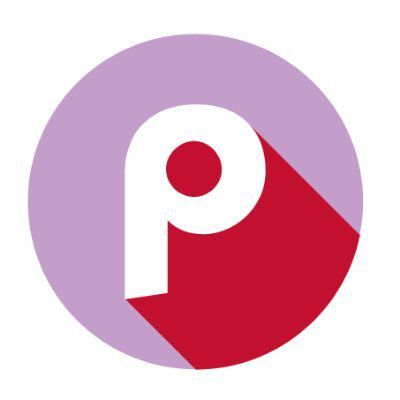
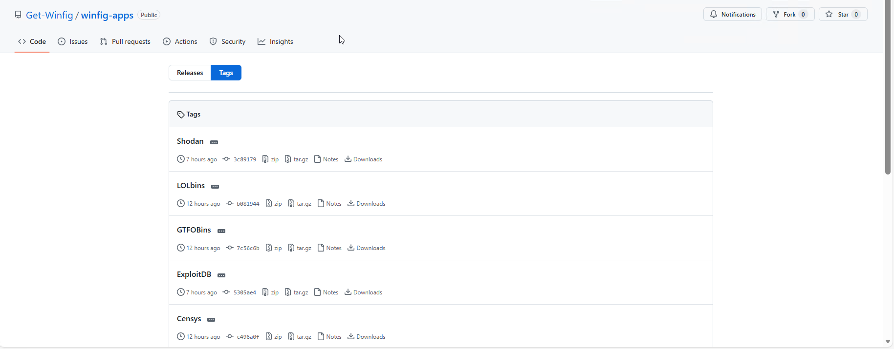
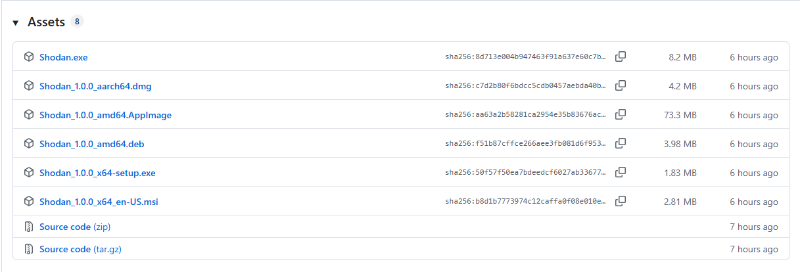
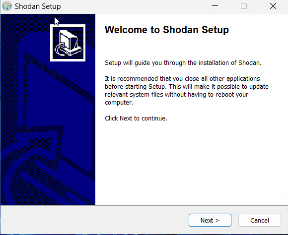

<h1 align="center">Winfig Apps: Enhance Your Windows Experience</h1>


<div align="center">
    <strong>Your Complete Windows Configuration and Automation Framework</strong>
</div>

---

## Overview

**Winfig Apps** is a curated collection of web services, packaged as lightweight desktop apps using Tauri. These are unofficial wrappers, providing a seamless, browser-free experience for your favorite cybersecurity and IT tools.

---

## Features

- **Easy Installation:** Install web services as standalone apps in a few clicks.
- **Lightweight:** Minimal resource usage compared to traditional desktop applications.
- **Website Integration:** Access your favorite web services without opening a browser.
- **Cross-Platform:** Built using Tauri for compatibility across operating systems.
- **Unofficial:** Not affiliated with the original web services, but convenient and open source.
- **Open Source:** [View on GitHub](https://github.com/Get-Winfig/winfig-apps)
- **Community Driven:** Contributions and suggestions are welcome!

---

## Why Winfig Apps?

While Progressive Web Apps (PWAs) are a popular way to turn web services into desktop-like experiences, they rely on your browser as a backend. This means they often consume significant RAM and CPU, especially when running multiple apps or tabs.

**Winfig Apps** use [Tauri](https://tauri.app/), which leverages a lightweight system webview instead of a full browser engine. This approach offers:

- **Lower resource usage:** Minimal RAM and CPU consumption compared to browser-based PWAs.
- **Better performance:** Faster startup and smoother operation.
- **Native integration:** Apps feel and behave more like true desktop applications.
- **Improved security:** Smaller attack surface and less exposure to browser vulnerabilities.

With Winfig Apps, you get the convenience of web services with the efficiency and feel of native desktop software.

---

## Available Apps

<div class="grid cards" markdown>

<!-- VirusTotal -->
-   
    <br>
    **VirusTotal**
    <br>
    <span style="font-size:0.95em;">A free online service that analyzes suspicious files, URLs, domains, and IP addresses using dozens of antivirus engines and blocklist services to detect malicious content</span>
    <br>
    [🌐 Open](https://www.virustotal.com/gui/home/upload) &nbsp; | &nbsp; [⬇️ Download](https://github.com/Get-Winfig/winfig-apps/releases/tag/VirusTotal)

<!-- AnyRun -->
-   
    <br>
    **AnyRun**
    <br>
    <span style="font-size:0.95em;">An interactive, cloud-based malware analysis sandbox that lets security professionals dynamically test suspicious files and URLs in a safe, virtual environment to see exactly how malware behaves.</span>
    <br>
    [🌐 Open](https://app.any.run) &nbsp; | &nbsp; [⬇️ Download](https://github.com/Get-Winfig/winfig-apps/releases/tag/AnyRun)

<!-- NetAcad -->
-   
    <br>
    **NetAcad**
    <br>
    <span style="font-size:0.95em;">A global educational program by Cisco that provides free online courses and resources for IT, cybersecurity, coding, and networking skills.</span>
    <br>
    [🌐 Open](https://www.netacad.com) &nbsp; | &nbsp; [⬇️ Download](https://github.com/Get-Winfig/winfig-apps/releases/tag/NetAcad)

<!-- HackTheBox -->
-   
    <br>
    **HackTheBox**
    <br>
    <span style="font-size:0.95em;">A leading online cybersecurity platform that provides gamified, real-world labs and simulations for individuals and enterprises to develop offensive (hacking) and defensive (SOC/DFIR) skills.</span>
    <br>
    [🌐 Open](https://www.hackthebox.com) &nbsp; | &nbsp; [⬇️ Download](https://github.com/Get-Winfig/winfig-apps/releases/tag/HackTheBox)

<!-- HTBAcademy -->
-   
    <br>
    **HTBAcademy**
    <br>
    <span style="font-size:0.95em;"> A cybersecurity training platform from Hack The Box (HTB), offering guided, interactive courses with hands-on practice to teach hacking skills, from beginner to advanced.</span>
    <br>
    [🌐 Open](https://academy.hackthebox.com) &nbsp; | &nbsp; [⬇️ Download](https://github.com/Get-Winfig/winfig-apps/releases/tag/HTBAcademy)

<!-- TryHackMe -->
-   
    <br>
    **TryHackMe**
    <br>
    <span style="font-size:0.95em;">A browser-based platform for learning and practicing cybersecurity skills through hands-on, virtual labs called "rooms".</span>
    <br>
    [🌐 Open](https://tryhackme.com) &nbsp; | &nbsp; [⬇️ Download](https://github.com/Get-Winfig/winfig-apps/releases/tag/TryHackMe)

<!-- PicoCTF -->
-   
    <br>
    **PicoCTF**
    <br>
    <span style="font-size:0.95em;">A free, gamified cybersecurity training program and competition for middle and high school students (and others) created by Carnegie Mellon University.</span>
    <br>
    [🌐 Open](https://picoctf.org) &nbsp; | &nbsp; [⬇️ Download](https://github.com/Get-Winfig/winfig-apps/releases/tag/PicoCTF)

<!-- CTFHacker101 -->
-   
    <br>
    **CTFHacker101**
    <br>
    <span style="font-size:0.95em;">A free, 24/7 online game by HackerOne where participants learn and practice web application hacking by finding hidden "flags".</span>
    <br>
    [🌐 Open](https://ctf.hacker101.com) &nbsp; | &nbsp; [⬇️ Download](https://github.com/Get-Winfig/winfig-apps/releases/tag/CTFHacker101)

<!-- CyberDefenders -->
-   
    <br>
    **CyberDefenders**
    <br>
    <span style="font-size:0.95em;">A leading blue team cybersecurity training platform providing hands-on, gamified labs and certifications (like the CCD) for SOC analysts, threat hunters, and incident responders to build skills in cyber defense, forensics, and threat detection.</span>
    <br>
    [🌐 Open](https://cyberdefenders.org) &nbsp; | &nbsp; [⬇️ Download](https://github.com/Get-Winfig/winfig-apps/releases/tag/CyberDefenders)

<!-- LetsDefend -->
-   
    <br>
    **LetsDefend**
    <br>
    <span style="font-size:0.95em;">A hands-on cybersecurity training platform, now part of Hack The Box, that offers simulated Security Operations Center (SOC) environments for individuals and teams to learn and practice "Blue Team".</span>
    <br>
    [🌐 Open](https://letsdefend.io) &nbsp; | &nbsp; [⬇️ Download](https://github.com/Get-Winfig/winfig-apps/releases/tag/LetsDefend)

<!-- PortSwigger -->
-   
    <br>
    **PortSwigger**
    <br>
    <span style="font-size:0.95em;">A leading cybersecurity company known for developing Burp Suite, the industry-standard toolkit for web application security testing and penetration testing, offering tools for vulnerability scanning, manual testing, and automated security assessments.</span>
    <br>
    [🌐 Open](https://portswigger.net) &nbsp; | &nbsp; [⬇️ Download](https://github.com/Get-Winfig/winfig-apps/releases/tag/PortSwigger)

<!-- Censys -->
-   
    <br>
    **Censys**
    <br>
    <span style="font-size:0.95em;">A powerful internet-wide search engine and data platform that continuously scans the entire public internet to discover, monitor, and analyze internet-connected devices, hosts, and infrastructure.</span>
    <br>
    [🌐 Open](https://search.censys.io) &nbsp; | &nbsp; [⬇️ Download](https://github.com/Get-Winfig/winfig-apps/releases/tag/Censys)

<!-- LOLbins -->
-   
    <br>
    **LOLbins**
    <br>
    <span style="font-size:0.95em;">A collection of living off the land binaries that can be used for various tasks.</span>
    <br>
    [🌐 Open](https://lolbas-project.github.io) &nbsp; | &nbsp; [⬇️ Download](https://github.com/Get-Winfig/winfig-apps/releases/tag/LOLbins)

<!-- GTFOBins -->
-   
    <br>
    **GTFOBins**
    <br>
    <span style="font-size:0.95em;">GTFOBins is a curated list of Unix binaries that can be used for privilege escalation.</span>
    <br>
    [🌐 Open](https://gtfobins.github.io) &nbsp; | &nbsp; [⬇️ Download](https://github.com/Get-Winfig/winfig-apps/releases/tag/GTFOBins)

<!-- ExploitDB -->
-   
    <br>
    **ExploitDB**
    <br>
    <span style="font-size:0.95em;"> A widely used, public, open-source repository of software vulnerabilities and their corresponding exploits maintained by Offensive Security. It serves as a vital resource for security professionals, ethical hackers, and researchers to find Proof-of-Concept code, learn about new vulnerabilities and understand how exploits work</span>
    <br>
    [🌐 Open](https://www.exploit-db.com) &nbsp; | &nbsp; [⬇️ Download](https://github.com/Get-Winfig/winfig-apps/releases/tag/ExploitDB)

<!-- Shodan -->
-   
    <br>
    **Shodan**
    <br>
    <span style="font-size:0.95em;"> A powerful search engine that finds and indexes internet-connected devices, not just websites, acting like a "search engine for hackers" to discover vulnerable IoT devices, servers, industrial control systems (ICS), and unsecured services exposed online.</span>
    <br>
    [🌐 Open](https://shodan.io) &nbsp; | &nbsp; [⬇️ Download](https://github.com/Get-Winfig/winfig-apps/releases/tag/Shodan)

<!-- MITREATT&CK -->
-   
    <br>
    **MITREATT&CK**
    <br>
    <span style="font-size:0.95em;">A globally-accessible knowledge base of adversary tactics and techniques based on real-world observations, used by security professionals to understand, detect, and prevent cyberattacks across enterprise, cloud, mobile, and industrial systems.</span>
    <br>
    [🌐 Open](https://attack.mitre.org) &nbsp; | &nbsp; [⬇️ Download](https://github.com/Get-Winfig/winfig-apps/releases/tag/MITREATT&CK)

</div>

---

## Release Files

!!! info "Multi-platform Installers"
    Winfig Apps are available for **Windows**, **macOS**, and **Linux**.
    Choose the installer that matches your operating system.

??? "Windows"
    | Installer Type         | Extension | Description                |
    |-----------------------|-----------|----------------------------|
    | **MSI Installer**   | `.msi`    | Standard Windows installer  |
    | **NSIS Installer**  | `.exe`    | Classic executable setup    |
    | **Portable Executable** | `.exe`    | No installation required    |

??? "macOS"
    | Installer Type         | Extension | Description                |
    |-----------------------|-----------|----------------------------|
    | **DMG Installer**        | `.dmg`    | Drag-and-drop installer     |
    | **Application Bundle**   | `.app`    | Standalone app bundle       |

??? "Linux"
    | Installer Type         | Extension | Description                |
    |-----------------------|-----------|----------------------------|
    | **DEB Package**          | `.deb`    | Debian/Ubuntu package       |
    | **AppImage**              | `.AppImage` | Portable universal binary   |


***Warning***:
None of the build assets are signed. You will get a warning during installation. Trust at your own risk or scan the files using antivirus software/VirusTotal.

---

## Installation

To install Winfig Apps, follow these steps:

1. Visit the [Winfig Apps GitHub Repository](https://github.com/Get-Winfig/winfig-apps/tags).


2. Download the latest release of the desired app.


3. Run the installer and follow the on-screen instructions.


4. Launch the app from your desktop or start menu.

---

## Local Development

To build and run Winfig Apps locally, ensure you have the following prerequisites installed:

### Prerequisites

- Install [Rust](https://www.rust-lang.org/tools/install)
- Install [Tauri CLI](https://tauri.app/v1/guides/getting-started/prerequisites)
- Install [Node.js](https://nodejs.org/) (LTS version recommended)
- Install [NPM](https://www.npmjs.com/get-npm)
- Install [Git](https://git-scm.com/)

### Installation

1. Clone the repository:

    ```bash
    git clone https://github.com/get-winfig/winfig-apps.git
    cd winfig-apps
    ```

3. Install dependencies:

    ```bash
    npm install
    ```

4. Add your desired app in the `scripts/apps.json` file.

    ```json
    "AppName": {
            "productName": "AppName",
            "description": "AppName - Desktop Application",
            "appIdentifier": "com.appname.desktop",
            "windowsTitle": "AppName - Desktop Application",
            "appLink": "https://appname.io",
            "appTitle": "AppName"
        },
    ```

5. Add the app icon in the `scripts/images` folder with the name `AppName.png`.

6. Run icons script to generate necessary icon files:

   ```bash
   npm run icons
   ```

7. Stage the changes:

   ```bash
   git add .
   ```

8. Make commit to run release script:

   ```bash
   git commit -m "release(AppName): Commit Message"
   ```

9. Run release script prepare the app:

   ```bash
   npm run release
   ```

10. Build and package the app:

   ```bash
   npm run build
   ```

11. The packaged app can be found in the `src-tauri/target/release/bundle` directory.

---

## Request an App

If you would like to request a new app for Winfig, please submit an issue in the [App Request](https://github.com/Get-Winfig/winfig-apps/issues/new/choose) with the following information:

1. Add a title to the issue in the format: `[App Request] <App Name>`
2. **App Name** : Name of the web service or application.
3. **App URL** : URL of the web service or application.
4. **Category/Type of App** : Category or type of the app (e.g., Web, Mobile, Desktop).
5. **Region Restrictions** : Any region restrictions for the app.
6. **App Description** : A brief description of the app and its functionality.
7. **App Icon URL** : URL to the app icon image.
8. **Additional Information** : Any other relevant information about the app.

---

## Legal Disclaimer & Copyright Notice

This desktop application is a third-party wrapper for the web application Shodan, provided solely for convenience and educational purposes. It is not affiliated with, endorsed by, or sponsored by the original web application or its developers.

- [x] The author and contributors do not own, operate, or control the website or its content.
- [x] No modifications, alterations, or interference are made to the website, its services, or its data.
- [x] All copyrights, trademarks, logos, and intellectual property remain the exclusive property of their respective owners.
- [x] This project is not affiliated with, endorsed by, sponsored by, or officially connected to the website or its creators in any way.
- [x] The author and contributors make no claims of ownership or rights to the website, its content, or its brand.
- [x] This software is distributed "**AS IS**" without warranty of any kind. Use at your own risk.
- [x] By downloading or using this application, you agree that the author and contributors are not liable for any damages, losses, or legal issues arising from its use.
- [x] All trademarks, service marks, logos, and brand names are the property of their respective owners.

Please respect the rights of the original content creators and use this application responsibly.

---

## Takedown Requests

If you are the owner of the web application or have legal authority over its content and wish to request the removal of this desktop application, please contact the repository owner directly through GitHub or dedicated [Takedown Issue](https://github.com/Get-Winfig/winfig-apps/issues/new/choose) Template in this repository's Issues section. Your request will be reviewed and acted upon promptly.

---

## Frequently Asked Questions (FAQ)

??? question "Are Winfig Apps official versions of these web services?"
    **No.** Winfig Apps are unofficial wrappers created for convenience. They are not affiliated with, endorsed by, or sponsored by the original web services or their developers.

??? question "Are Winfig Apps safe to use?"
    Winfig Apps are open source and you can review the code on [GitHub](https://github.com/Get-Winfig/winfig-apps). However, **none of the build assets are signed**. Always download from the official GitHub releases and consider scanning files with antivirus or VirusTotal.

??? question "Do Winfig Apps require an internet connection?"
    Yes, since these apps wrap web services, an active internet connection is required for them to function.

??? question "How do I update a Winfig App?"
    Download the latest release from the [GitHub Releases](https://github.com/Get-Winfig/winfig-apps/releases) page and install it over your existing version.

??? question "Can I request a new app to be added?"
    Absolutely! Please submit an [App Request](https://github.com/Get-Winfig/winfig-apps/issues/new/choose) with details about the web service you want.

??? question "What platforms are supported?"
    Winfig Apps are available for **Windows**, **macOS**, and **Linux**. See the [Release Files](#release-files) section for details.

??? question "Why do I get a warning during installation?"
    The installers are **not digitally signed**, so your operating system may warn you. This is expected for unsigned open-source projects. You can verify the files by scanning them with antivirus software.

??? question "How can I contribute or report a bug?"
    Contributions and bug reports are welcome! Please open an issue or pull request on the [GitHub repository](https://github.com/Get-Winfig/winfig-apps).

??? question "Can I customize or build my own Winfig App?"
    Yes! See the [Local Development](#local-development) section for instructions on building and packaging your own apps.

??? question "Who do I contact for takedown requests or legal concerns?"
    Please use the [Takedown Issue Template](https://github.com/Get-Winfig/winfig-apps/issues/new/choose) on GitHub or contact the repository owner directly.

