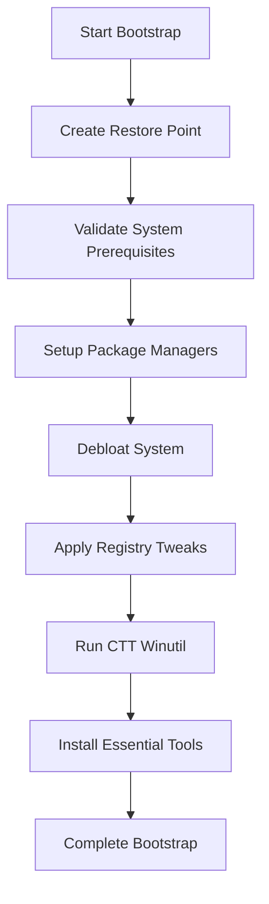
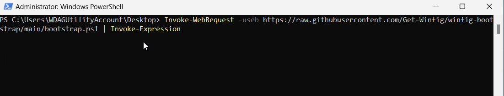
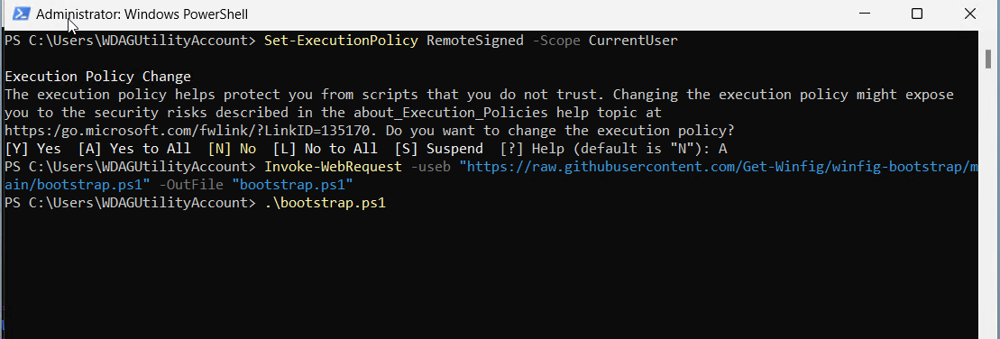
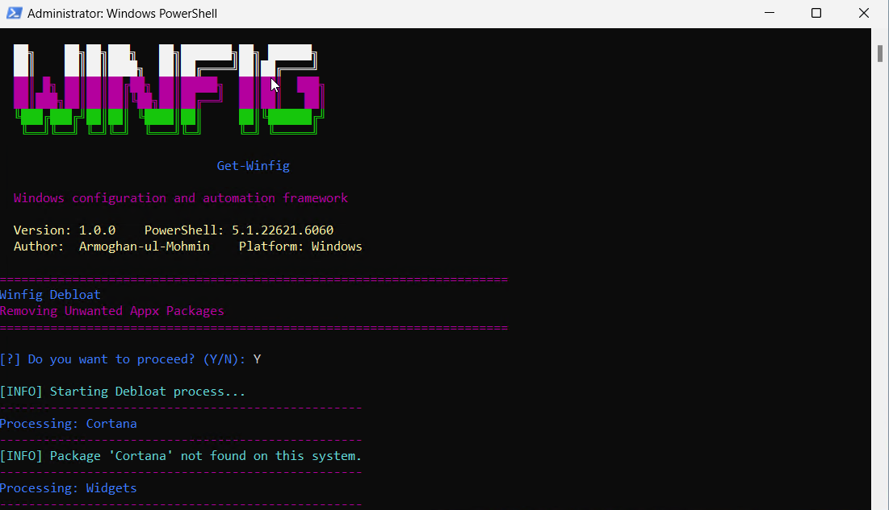
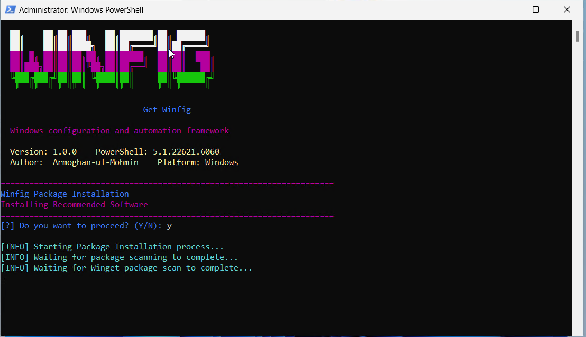

<h1 align="center">Winfig Bootstrap: Bootstrapping Your Windows Environment</h1>


<div align="center">
  <strong>Your Complete Windows Configuration and Automation Framework</strong>
</div>

---

## Overview
**Winfig Bootstrap** is a foundational module within the Winfig ecosystem designed to provide a comprehensive solution for setting up a complete Windows development environment. This enterprise-grade toolkit automatically configures your system with essential tools, package managers, and development utilities.

---

## Features Overview

| Feature | Description |
|---------|-------------|
| **Safety & Backup** | Creates restoration points and validates system |
| **System Validation** | Verifies prerequisites and compatibility |
| **Bloatware Removal** | Removes 40+ unnecessary applications |
| **Package Managers** | Integrates Chocolatey and Winget |
| **Registry Tweaks** | Applies 15+ performance optimizations |
| **Tool Installation** | Installs 50+ essential utilities |
| **Winutil Integration** | CTT Winutil for system management |
| **Logging & Reporting** | Detailed operation logs and auditing |

---

## Prerequisites

Before running Winfig Bootstrap, ensure your system meets these requirements:

- [x] **Operating System**: Windows 11 (Build 22000 or higher)
- [x] **PowerShell**: Version 5.1 or higher
- [x] **Privileges**: Administrator/elevated privileges required
- [x] **Internet**: Active internet connection required
- [x] **Storage**: Minimum 10GB free disk space
- [x] **Execution Policy**: Must allow script execution (RemoteSigned, Unrestricted, or Bypass)

---

## What Bootstrap Does

<div class="grid cards" markdown>

-   __Safety First__

    ---

    Creates system restore points and validates prerequisites before making any changes

-   __Remove Bloatware__

    ---

    Intelligently removes 40+ unnecessary apps and services to optimize performance

-   __Registry Optimization__

    ---

    Applies 15+ essential registry tweaks for better privacy and usability

-   __Tool Installation__

    ---

    Installs 50+ essential development tools, utilities, and applications

</div>


---

##  Bootstrap Workflow



### Progress Tracking
The script provides real-time feedback:

- [x] **Phase 1**: System Preparation (2-5 minutes)
- [x] **Phase 2**: Package Manager Setup (5-10 minutes)
- [x] **Phase 3**: Debloat the system (5-10 minutes)
- [x] **Phase 4**: Apply Registry Tweaks (3-7 minutes)
- [x] **Phase 5**: Run CTT Winutil (5-10 minutes)
- [x] **Phase 6**: Install Tools (30-60 minutes)

!!! info "Total Time"
    Complete bootstrap typically takes **40-90 minutes** depending on your internet connection and system specifications.

---


## Installation Methods

=== "Web Install (Recommended)"

    **One-line installation** - Downloads and runs automatically:

    ```powershell title="Run in Administrative PowerShell"
    Invoke-RestMethod -useb https://raw.githubusercontent.com/Get-Winfig/winfig-bootstrap/main/bootstrap.ps1 | Invoke-Expression
    ```

    !!! success "Why Web Install?"
        - Always gets the latest version
        - No manual download required
        - Automatic script verification
    

=== "Local Install"

    **Download and run manually** for offline environments:

    ```powershell title="1. Set Execution Policy"
    Set-ExecutionPolicy RemoteSigned -Scope CurrentUser
    ```

    ```powershell title="2. Download Script"
    # Download from GitHub
    Invoke-WebRequest -useb "https://raw.githubusercontent.com/Get-Winfig/winfig-bootstrap/main/bootstrap.ps1" -OutFile "bootstrap.ps1"
    ```

    ```powershell title="3. Unblock and Run"
    Unblock-File -Path .\Bootstrap.ps1
    .\Bootstrap.ps1
    ```

    !!! warning "Note"
        - Ensure you have the latest script version
        - Manual updates required for new releases
        - Verify script integrity before running
    

---

## Debloat Features



!!! abstract "Bloatware Removal Summary"
    Bootstrap removes **40+ unnecessary applications** across 6 categories to optimize your Windows environment and improve system performance.

=== "Microsoft Built-in Apps"

    | Application | Description |
    |-------------|-------------|
    | **Cortana** | Microsoft's virtual assistant |
    | **Widgets** | Windows 11 widgets panel and platform runtime |
    | **Get Help** | Microsoft help application |
    | **Weather** | Microsoft Weather app |
    | **News** | Microsoft News app |
    | **Microsoft To Do** | Task management application |
    | **Solitaire Collection** | Card games collection |
    | **Feedback Hub** | Windows feedback collection tool |
    | **Office Hub** | Microsoft Office launcher |
    | **Power Automate Desktop** | Workflow automation tool |
    | **3D Viewer** | 3D model viewing application |
    | **Skype** | Video calling application (consumer version) |
    | **Tips App** | Windows tips and tutorials |
    | **OneNote for Windows 10** | Note-taking application (legacy version) |
    | **Sticky Notes** | Digital sticky notes application |
    | **Mixed Reality Portal** | VR/AR platform interface |
    | **Quick Assist** | Remote assistance tool |
    | **Dev Home** | Developer environment setup tool |
    | **Microsoft Security** | Security management dashboard |
    | **Start Experiences App** | Start menu enhancement features |
    | **Microsoft PC Manager** | System optimization tool |
    | **Maps** | Microsoft Maps application |
    | **Alarms & Clock** | Time management utilities |
    | **People** | Contact management application |
    | **Movies & TV** | Media player application |
    | **Groove Music** | Music player application |
    | **Get Started** | Windows introduction app |
    | **Microsoft Pay** | Digital wallet application |
    | **Mobile Plans** | Cellular plan management |
    | **Microsoft Messaging** | SMS/messaging application |
    | **Snip & Sketch / Snipping Tool** | Screenshot utilities |

=== "Xbox and Gaming Apps"

    | Application | Description |
    |-------------|-------------|
    | **Xbox Console Companion** | Legacy Xbox application |
    | **Xbox Gaming App** | Modern Xbox gaming platform |
    | **Xbox Identity Provider** | Xbox authentication service |
    | **Xbox Speech To Text Overlay** | Gaming accessibility feature |
    | **Xbox Game Overlay** | In-game overlay system |
    | **Xbox Live in-game experience** | Gaming social features |

=== "Microsoft Teams"

    | Application | Description |
    |-------------|-------------|
    | **Microsoft Teams (Personal)** | Consumer video calling |
    | **Microsoft Teams** | Business communication platform |

=== "Third-Party Preinstalled Apps"

    | Application | Description |
    |-------------|-------------|
    | **Spotify** | Music streaming application |
    | **Disney+** | Video streaming service |
    | **Instagram** | Social media application |
    | **LinkedIn** | Professional networking application |

=== "Search and Web Features"

    | Application | Description |
    |-------------|-------------|
    | **Bing Search** | Integrated web search functionality |
    | **Clipchamp** | Video editing application |

=== "System Integration Apps"

    | Application | Description |
    |-------------|-------------|
    | **Widgets Platform Runtime** | Backend for widgets system |
    | **Start Experiences App** | Enhanced start menu features |

!!! info "Safe Removal"
    All applications are safely removed without affecting core Windows functionality. The process only removes existing applications and will not attempt to uninstall apps that are not present.

!!! warning "Recovery"
    Removed applications can be reinstalled from the Microsoft Store if needed. A system restore point is created before any changes.

---

## Registry Tweaks


!!! abstract "Registry Optimization Summary"
    Bootstrap applies **20+ essential registry tweaks** across 7 categories to enhance system performance, security, privacy, and usability.

=== "Appearance & Theming"

    | Tweak | Description |
    |-------|-------------|
    | **Enable Dark Mode for Apps** | Sets applications to use dark theme |
    | **Enable Dark Mode for System** | Sets system interface to use dark theme |

=== "Search & Start Menu"

    | Tweak | Description |
    |-------|-------------|
    | **Disable Bing Search in Start Menu** | Removes web search integration from Start menu |
    | **Show Search Icon in Taskbar** | Displays search icon instead of search box |
    | **Hide Recommended Section in Start Menu** | Removes suggested apps and files from Start menu |
    | **Hide Recommended Files in Explorer** | Removes file recommendations in File Explorer |

=== "Boot & System Messages"

    | Tweak | Description |
    |-------|-------------|
    | **Enable Verbose Boot Messages** | Shows detailed startup information |
    | **Show Crash Details on BSOD** | Displays technical information during system crashes |
    | **Disable Sad Face on BSOD** | Removes emoticon from Blue Screen of Death |

=== "Education Features"

    | Tweak | Description |
    |-------|-------------|
    | **Disable Education Environment Features** | Turns off education-specific functionality |

=== "Mouse & Input"

    | Tweak | Description |
    |-------|-------------|
    | **Enable Enhanced Pointer Precision** | Improves mouse accuracy |
    | **Set Mouse Acceleration Threshold 1** | Configures first acceleration point (6) |
    | **Set Mouse Acceleration Threshold 2** | Configures second acceleration point (10) |
    | **Disable Sticky Keys Notifications** | Prevents accessibility prompts |

=== "File Explorer"

    | Tweak | Description |
    |-------|-------------|
    | **Show Hidden Files and Folders** | Displays hidden system files and folders |
    | **Show File Extensions** | Shows file extensions for all file types |
    | **Hide Task View Button** | Removes Task View button from taskbar |

=== "Privacy & Telemetry"

    | Tweak | Description |
    |-------|-------------|
    | **Disable Implicit Text Input Collection** | Prevents text input data collection |
    | **Disable Implicit Ink Input Collection** | Prevents handwriting data collection |
    | **Disable Silently Installed Apps/Suggestions** | Stops automatic app installations |
    | **Disable Consumer Features** | Removes pre-installed apps and suggestions |
    | **Disable Windows Telemetry/Data Collection** | Turns off system data collection |
    | **Disable Spotlight/Ads on Lock Screen** | Removes advertising from lock screen |
    | **Disable Customer Experience Improvement Program (CEIP)** | Stops participation in feedback program |

!!! info "Registry Safety"
    All registry modifications are applied safely with proper validation. A system restore point is created before any changes are made.

!!! success "Benefits"
    These tweaks improve system performance, enhance privacy, reduce telemetry, and create a cleaner Windows experience while maintaining system stability.

---

## Installed Tools & Applications



!!! abstract "Package Summary"
    Bootstrap installs **50+ carefully selected tools** across 8 categories, with optional installations marked for user choice.

=== "Development"

    | Tool | Description | Installation |
    |------|-------------|-------------|
    | **Git** | Version control system for tracking code changes | Required |
    | **Visual Studio Code** | Feature-rich code editor with IntelliSense | Required |
    | **GitHub CLI** | Official GitHub command-line interface | Optional |
    | **Sublime Text 4** | High-performance text editor | Required |
    | **Neovim** | Hyperextensible Vim-based text editor | Optional |
    | **Neovide** | Modern GUI for Neovim | Optional |

=== "Programming Languages"

    | Tool | Description | Installation |
    |------|-------------|-------------|
    | **Go** | Statically typed compiled language | Required |
    | **Rust** | Systems programming language | Required |
    | **LLVM-MinGW** | C++ build tools and compiler | Required |
    | **uv** | Ultra-fast Python package installer | Required |
    | **nvm-windows** | Node.js version manager | Required |

=== "Terminal & CLI Tools"

    | Tool | Description | Installation |
    |------|-------------|-------------|
    | **PowerShell** | Cross-platform automation platform | Required |
    | **Windows Terminal** | Modern terminal application | Required |
    | **LazyGit** | Beautiful terminal interface for Git | Optional |
    | **OneFetch** | Project information with ASCII art | Optional |
    | **Bat** | Enhanced file viewer with syntax highlighting | Required |
    | **fzf** | Blazing-fast command-line fuzzy finder | Required |
    | **ripgrep** | Ultra-fast text search tool | Required |
    | **Starship** | Minimal, fast, customizable prompt | Required |
    | **Zoxide** | Smarter cd command | Required |
    | **Fastfetch** | System information tool | Required |
    | **Delta** | Syntax-highlighting pager for Git | Required |

=== "System Utilities"

    | Tool | Description | Installation |
    |------|-------------|-------------|
    | **DevToys** | Comprehensive developer toolbox | Optional |
    | **7-Zip** | High-compression file archiver | Required |
    | **ShareX** | Advanced screen capture tool | Required |
    | **PowerToys** | Collection of Windows utilities | Required |
    | **Nilesoft Shell** | Enhanced Windows context menu | Required |
    | **gsudo** | Sudo for Windows command-line | Required |
    | **OpenHashTab** | File checksum verification in Explorer | Required |
    | **Super File** | Modern dual-pane file manager | Optional |
    | **AutoHotkey** | Scripting for hotkeys and automation | Required |
    | **HashMyFiles** | Lightweight hash calculation utility | Required |
    | **ExifTool** | Metadata reading/writing tool | Required |
    | **Ntop** | Htop-like system monitor for Windows | Optional |
    | **Windhawk** | Windows customization tool | Required |

=== "Web & Internet"

    | Tool | Description | Installation |
    |------|-------------|-------------|
    | **HTTrack** | Website downloader for offline browsing | Optional |
    | **Zen Browser** | Privacy-focused web browser | Required |
    | **OpenVPN** | Open-source VPN solution | Required |

=== "Communication & Productivity"

    | Tool | Description | Installation |
    |------|-------------|-------------|
    | **Thunderbird** | Full-featured email and calendar client | Optional |
    | **Notion** | All-in-one workspace for notes and tasks | Optional |
    | **Obsidian** | Powerful knowledge base on Markdown files | Optional |
    | **Zoom** | HD video meetings and webinars | Optional |
    | **Discord** | Voice, video, and text chat platform | Optional |
    | **Telegram** | Cloud-based instant messaging | Optional |

=== "Cloud Storage"

    | Tool | Description | Installation |
    |------|-------------|-------------|
    | **OneDrive** | Microsoft cloud storage with Office integration | Optional |
    | **Google Drive** | Google file storage and collaboration | Optional |
    | **Dropbox** | Cloud storage with file synchronization | Optional |

=== "Remote Access"

    | Tool | Description | Installation |
    |------|-------------|-------------|
    | **AnyDesk** | Fast remote desktop access solution | Optional |

!!! info "Installation Types"
    - **Required**: Automatically installed for optimal development environment
    - **Optional**: User prompted for confirmation during installation

!!! tip "Customization"
    You can modify the package list in the script to add or remove tools based on your specific needs.

---

## Troubleshooting

!!! danger "Common Issues"
    Most installation problems fall into these categories:

=== "Execution Policy"

    **Problem**: `execution of scripts is disabled on this system`
    

    **Solution**:
    ```powershell
    Set-ExecutionPolicy RemoteSigned -Scope CurrentUser -Force
    ```

=== "Administrator Rights"

    **Problem**: `Access denied` or permission errors

    **Solution**:
    1. Right-click PowerShell icon
    2. Select "Run as Administrator"
    3. Confirm UAC prompt

=== "Network Issues"

    **Problem**: Downloads fail or timeout

    **Solutions**:

    - Check internet connection
    - Disable VPN temporarily
    - Try different DNS (8.8.8.8)
    - Run Windows Network Troubleshooter

=== "Package Failures"

    **Problem**: Individual packages fail to install

    **Solutions**:
    ```powershell
    # Reset Windows Update components
    net stop wuauserv
    net start wuauserv

    # Clear package manager cache
    winget source reset --force
    choco cache clean
    ```

### Diagnostic Commands

```powershell title="System Health Check"
# Check system integrity
sfc /scannow

# Verify package managers
winget --version
choco --version

# Test internet connectivity
Test-NetConnection -ComputerName "8.8.8.8" -Port 53
```
