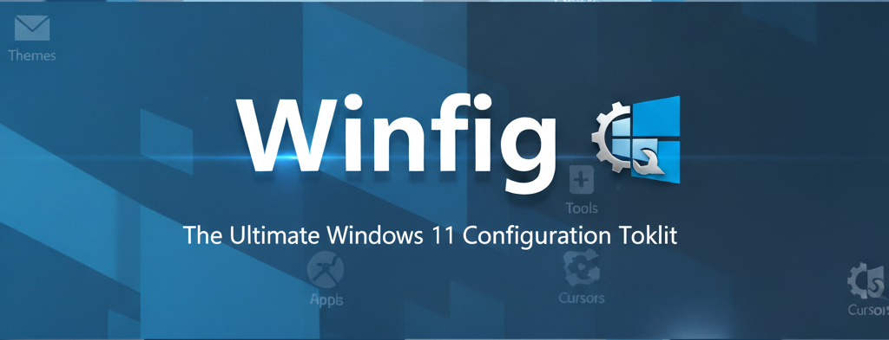

<h1 align="center">Winfig Browsers: Automated Browser Setup & Customization</h1>



<div align="center">
  <strong>Your Complete Windows Configuration and Automation Framework</strong>
</div>

---

## Overview

**Winfig Browsers** provides one-click automation scripts to install, configure, and optimize your favorite browsers—Edge, Brave, and Zen—for privacy, productivity, and a beautiful Windows experience. Instantly apply custom settings, extensions, themes, and privacy tweaks across all supported browsers.

---

## Supported Browsers

- **Microsoft Edge** (Chromium)
- **Brave Browser**
- **Zen Browser**

---

## Why Use Winfig Browsers?

- **Save time** with automated, repeatable browser setup
- **Instantly apply privacy, security, and UI tweaks**
- **Sync extensions, bookmarks, and settings** across devices
- **Remove bloatware and disable telemetry** with one command
- **Consistent look and feel** across all browsers

---

## Features

| Feature                | Description                                                                 |
|------------------------|-----------------------------------------------------------------------------|
| Automated Install      | One-command install for Edge, Brave, and Zen                                |
| Privacy Hardening      | Disables telemetry, tracking, and ads by default                            |
| Extension Sync         | Installs your favorite extensions automatically                             |
| Custom Themes          | Applies Catppuccin or your preferred theme for a beautiful UI               |
| Bookmarks Import       | Syncs bookmarks from your Winfig profile                                    |
| Default Settings       | Sets preferred search engine, homepage, and new tab page                    |
| Bloatware Removal      | Removes pre-installed/promotional content                                   |
| Cross-Browser Profiles | Ensures consistent profiles and settings across all supported browsers      |
| Scriptable Actions     | Easily extend with your own PowerShell or shell scripts                     |
| Portable & Reproducible| Works on fresh installs, VMs, and multi-user setups                         |

---

## Microsoft Edge Setup

### Requirements

- [x] [MsEdge](https://www.microsoft.com/en-us/edge/download) installed on Windows 11
- [x] [PowerShell 5+](https://github.com/PowerShell/PowerShell) for automation and scripting
- [x] [Git](https://git-scm.com/download/win) for automation script.
- [x] Administrator privileges for certain configurations
- [x] Internet access for downloading dependencies

---

### Pre-Installation

Before running the Winfig automation, it’s recommended to declutter your Edge home page for a cleaner, distraction-free experience. Follow these steps:

#### Edge Home Page Cleanup

1. **Open Microsoft Edge**
2. **Navigate to the Home Page** and click the **Settings** icon.
   
3. In the settings panel, adjust the following toggles for a minimal look:
    - **Quick Links:** Set to `Off`
    - **Open in New Tab:** Set to `Off`
    - **Show Feed:** Set to `Off`
    - **Background:** Set to `Off`
    - **Show Weather:** Set to `Off`

   

#### Edge Rewards

1. Navigate to [edge://settings/profiles/rewards](edge://settings/profiles/rewards)
    - **Edge Rewards:** Set to `Off`

   

#### Password Autofill Settings

1. Navigate to [edge://settings/autofill/passwords/settings](edge://settings/autofill/passwords/settings)
    - **Ask to Save Password:** Set to `Off`
    - **Autofill Password:** Set to `Off`
    - **Show Reveal Button:** Set to `Off`
    - **Set Strong Passwords:** Set to `Off`

   

#### Appearance

1. Navigate to [edge://settings/appearance](edge://settings/appearance)
    - **Overall Appearance:** Set to `Dark`
    - **Theme:** Set to a dark shade

   

#### Default Browser

1. Navigate to [edge://settings/defaultBrowser](edge://settings/defaultBrowser)
    - **Allow Sites to reload in Internet Explorer:** Set to `Don't Allow`

   

#### Copilot & Sidebar

1. Navigate to [edge://settings/appearance/copilotAndSidebar/appSettings?hubApp=cd4688a9-e888-48ea-ad81-76193d56b1be](edge://settings/appearance/copilotAndSidebar/appSettings?hubApp=cd4688a9-e888-48ea-ad81-76193d56b1be)
    - **Show Copilot Button on toolbar:** Set to `Off`

   

#### System Settings

1. Navigate to [edge://settings/system/manageSystem](edge://settings/system/manageSystem)
    - **Start at Boot:** Set to `Off`
    - **Continue to run extensions in background:** Set to `Off`

   

#### Toolbar Customization

1. Navigate to [edge://settings/appearance/toolbar](edge://settings/appearance/toolbar)
    - **Show briefcase icon to represent workspace:** Set to `Off`
    - **Home:** Set to `On`
    - **Extensions:** Set to `Always show`
    - **Split Screen:** Set to `On`
    - **Downloads:** Set to `On`

   

#### Enable Vertical Tabs

Vertical tabs in Microsoft Edge help you organize and manage multiple tabs more efficiently, especially on widescreen monitors. Here’s how to enable and use them:

1. **Right-click** on any open browser tab at the top of the Edge window.
2. In the context menu, select **"Turn on vertical tabs"**.
   You can also use the shortcut <kbd>Ctrl</kbd> + <kbd>Shift</kbd> + <kbd>,</kbd> for quick access.

   

3. Once vertical tabs are enabled, you’ll see your tabs listed vertically on the left side of the browser.
4. To maximize your workspace, click the **Collapse Panel** button to hide tab labels and show only icons.

   

> **Tip:** You can expand or collapse the vertical tabs panel at any time to suit your workflow. This feature is especially useful for users who keep many tabs open.

---

### Installation Methods

=== "Web Install (Recommended)"

    **One-line installation** - Downloads and runs automatically:

    ```powershell title="Run in Administrative PowerShell"
    Invoke-RestMethod -useb https://raw.githubusercontent.com/Get-Winfig/winfig-browser/refs/heads/main/Edge/setup.ps1 | Invoke-Expression
    ```

    !!! success "Why Web Install?"
        - Always gets the latest version
        - No manual download required
        - Automatic script verification
    

=== "Local Install"

    **Download and run manually** for offline environments:

    ```powershell title="1. Set Execution Policy"
    Set-ExecutionPolicy RemoteSigned -Scope CurrentUser
    ```

    ```powershell title="2. Download Script"
    # Download from GitHub
    Invoke-WebRequest -useb "https://raw.githubusercontent.com/Get-Winfig/winfig-browser/refs/heads/main/Edge/setup.ps1" -OutFile "setup.ps1"
    ```

    ```powershell title="3. Unblock and Run"
    Unblock-File -Path .\setup.ps1
    .\setup.ps1
    ```

    !!! warning "Note"
        - Ensure you have the latest script version
        - Manual updates required for new releases
        - Verify script integrity before running
    

---

## Zen Browser Setup

### Requirements

- [x] [Zen](https://zen-browser.app/download) installed on Windows 11
- [x] [PowerShell 5+](https://github.com/PowerShell/PowerShell) for automation and scripting
- [x] [Git](https://git-scm.com/download/win) for automation script.
- [x] Administrator privileges for certain configurations
- [x] Internet access for downloading dependencies

---

### Installation Methods

=== "Web Install (Recommended)"

    **One-line installation** - Downloads and runs automatically:

    ```powershell title="Run in Administrative PowerShell"
    Invoke-RestMethod -useb https://raw.githubusercontent.com/Get-Winfig/winfig-browser/refs/heads/main/Zen/setup.ps1 | Invoke-Expression
    ```

    !!! success "Why Web Install?"
        - Always gets the latest version
        - No manual download required
        - Automatic script verification
    

=== "Local Install"

    **Download and run manually** for offline environments:

    ```powershell title="1. Set Execution Policy"
    Set-ExecutionPolicy RemoteSigned -Scope CurrentUser
    ```

    ```powershell title="2. Download Script"
    # Download from GitHub
    Invoke-WebRequest -useb "https://raw.githubusercontent.com/Get-Winfig/winfig-browser/refs/heads/main/Zen/setup.ps1" -OutFile "setup.ps1"
    ```

    ```powershell title="3. Unblock and Run"
    Unblock-File -Path .\setup.ps1
    .\setup.ps1
    ```

    !!! warning "Note"
        - Ensure you have the latest script version
        - Manual updates required for new releases
        - Verify script integrity before running
    

---

### Post-Installation Steps

After running the Winfig automation for Zen Browser, follow these steps to complete your setup and ensure all customizations and extensions are properly configured.

#### Customize Toolbar & Bookmarks

A streamlined toolbar makes your workflow faster and more productive.

1. **Left-click** on the top bar of Zen Browser.
2. Click **Customize toolbar**.
   
3. **Drag the bookmark menu** and place it in the top bar for quick access.
   

#### Import Stylus Configuration

Stylus allows you to apply custom user styles to websites. To import your Winfig Stylus configuration:

1. **Open Zen Browser** and wait for all extensions to finish installing.
2. Go to the add-ons page: [about:addons](about:addons)
3. In the search bar, type `Stylus` and locate the extension.
4. Click the **three dots** next to Stylus and select **Options**.
5. In the Stylus options page, choose **Import** and select your provided Stylus configuration file.


#### Import Dark Reader Settings

Dark Reader provides a customizable dark mode for all websites. To import your Winfig Dark Reader settings:

1. In the Zen Browser, locate the **pinned extensions** area and find `Dark Reader`.
2. Click the **More** button (three dots) next to Dark Reader.
3. Select **All Options** to open the settings page.


4. Navigate to the **Advanced** tab.
5. Click **Import Settings** and upload your Dark Reader configuration file.


Zen Browser supports advanced mods for UI and productivity enhancements. Here’s how to apply your Winfig mods:

**Bookmark Toolbar Tweaks**

1. Navigate to [about:settings#sineMods](about:settings#sineMods)
2. Search for **"BookmarkToolbarTweaks"**
3. Click the **Gear icon** to open settings
4. Enable:
    - **Center the bookmark toolbar**
    - **Auto Hide: Expand by hovering**
    - **Auto Hide: Expand when searching**

   

**Custom UI Fonts**

1. Search for **"Custom Ui Fonts"**
2. Click the **Gear icon** to open settings
3. Set **Select fonts** to `Custom`
4. Set **font family** to `Hack Nerd Fonts`

   

**Zen Minimal Exit Menu**

1. Search for **"Zen Minimal Exit Menu"**
2. Click the **Gear icon** to open settings
3. Enable:
    - **Make theme more identical to macOS**
    - **Show Window icon**

   

#### Import Bookmarks (Optional)

1. Press <kbd>Ctrl</kbd> + <kbd>Shift</kbd> + <kbd>O</kbd> to open the bookmarks manager.
2. Click on **Import and backup** in the top menu.
3. Select **Restore** from the dropdown.
4. Click **Choose File** to browse for your bookmarks backup file.
   
5. Select your backup file and confirm the import.
   
---

## Brave Setup

### Requirements

- [x] [Brave](https://brave.com/download/) installed on Windows 11
- [x] [PowerShell 5+](https://github.com/PowerShell/PowerShell) for automation and scripting
- [x] [Git](https://git-scm.com/download/win) for automation script.
- [x] Administrator privileges for certain configurations
- [x] Internet access for downloading dependencies

---

### Pre-Installation

Before running the Winfig automation, it’s recommended to declutter your Brave home page for a cleaner, distraction-free experience. Follow these steps:

#### Brave Home Page Cleanup

1. **Open Brave**
2. **Navigate to the Home Page** and click the **Settings** icon.
   
3. In the settings panel, adjust the following toggles for a minimal look:
    - **Show Background Image:** Set to `Off`
    - **Brave VPN:** Set to `Off`
    - **Brave Rewards:** Set to `Off`
    - **Brave Talk:** Set to `Off`

   

#### Appearance Settings

Customize Brave's appearance for a cleaner, more productive browsing experience:

1. Navigate to [brave://settings/appearance](brave://settings/appearance)
2. **Theme Settings:** Click **"Theme"** and set it to **"Dark"**
3. **Toolbar Customization:**
    - Click **"Customize your toolbar"**
    - Enable: **"Home"** and **"Downloads"**
    - Disable all other toolbar items for a minimal look
4. **Bookmarks Bar:**
    - Set **"Show bookmarks bar"** to **"Always"**
    - Set **"Automatically pin new tab groups created on any device to the bookmarks"** to `Off`
5. **Address Bar:**
    - Set **"Show autocomplete suggestions in address bar"** to `Off`
7. **Tabs & Layout:**
    - Set **"Use vertical tabs"** to `On`
    - Set **"Show title bar"** to `On`
    - Set **"Tab hover mode"** to **"Card with Preview"**
8. **Sidebar:**
    - Set **"Show Sidebar"** to **"Never"**

#### Enable Vertical Tabs

1. After enabling vertical tabs in settings, locate the vertical tabs panel on the left side.
2. Click the **tab icon** to compress the sidebar and maximize your workspace.

   

> **Tip:** Vertical tabs help you manage multiple tabs efficiently, especially on widescreen monitors. You can expand or collapse the panel at any time.

#### System Settings

Optimize Brave's system behavior for better performance and privacy:

1. Navigate to [brave://settings/system](brave://settings/system)
2. **Background Apps:**
    - Set **"Continue running background apps when Brave is closed"** to `Off`
3. **Tab Warnings:**
    - Set **"Warn me before closing window with multiple tabs"** to `Off`
5. **Performance:**
    - Enable **"Memory Saver"** and set it to **"Maximum"**
    - Enable **"Energy saver"**

> **Tip:** Disabling background apps and enabling memory/energy savers improves system performance and extends battery life on laptops.

#### Import Bookmarks (Optional)

Easily restore your bookmarks for Brave Browser using the built-in import feature:

1. Navigate to [brave://bookmarks/](brave://bookmarks/)
2. Click on the **three dots** (menu icon) in the top-right corner.
3. Select **"Import bookmarks"** from the dropdown menu.
   
4. Browse and select your bookmarks file  `hacking.html` and confirm the import.
   

> **Tip:** Importing bookmarks ensures your favorite sites and folders are instantly available in your new Brave Browser profile.

---

### Installation Methods

=== "Web Install (Recommended)"

    **One-line installation** - Downloads and runs automatically:

    ```powershell title="Run in Administrative PowerShell"
    Invoke-RestMethod -useb https://raw.githubusercontent.com/Get-Winfig/winfig-browser/refs/heads/main/Brave/setup.ps1 | Invoke-Expression
    ```

    !!! success "Why Web Install?"
        - Always gets the latest version
        - No manual download required
        - Automatic script verification
    

=== "Local Install"

    **Download and run manually** for offline environments:

    ```powershell title="1. Set Execution Policy"
    Set-ExecutionPolicy RemoteSigned -Scope CurrentUser
    ```

    ```powershell title="2. Download Script"
    # Download from GitHub
    Invoke-WebRequest -useb "https://raw.githubusercontent.com/Get-Winfig/winfig-browser/refs/heads/main/Brave/setup.ps1" -OutFile "setup.ps1"
    ```

    ```powershell title="3. Unblock and Run"
    Unblock-File -Path .\setup.ps1
    .\setup.ps1
    ```

    !!! warning "Note"
        - Ensure you have the latest script version
        - Manual updates required for new releases
        - Verify script integrity before running
    

---

## Frequently Asked Questions (FAQ)

??? question "Can I use Winfig Browsers on a work or school computer?"
    You need administrator rights for full automation. Some organizations may restrict browser installs or script execution. Check with your IT department before running these scripts.

??? question "Will this overwrite my existing browser settings?"
    By default, Winfig creates new profiles or modifies existing ones based on the script. It's recommended to backup your current settings before running the automation.

??? question "How do I add my own extensions or settings?"
    You can customize the installation scripts by editing the configuration files in the Winfig repository before running setup. Look for `extensions.json` or similar config files.

??? question "Is this safe to use?"
    All scripts are open source and can be reviewed on the [Winfig GitHub repository](https://github.com/Get-Winfig) before running. Always verify the source and integrity of scripts you download.

??? question "Can I run these scripts on multiple machines?"
    Yes! Winfig Browsers is designed for portable, reproducible setups across fresh installs, VMs, and multi-user environments.

??? question "How do I update my browser configuration after installation?"
    You can re-run the installation scripts at any time to update settings, or manually adjust configurations in your browser's settings pages.

??? question "Does Winfig Browsers support other browsers like Firefox or Chrome?"
    Currently, Winfig Browsers supports Microsoft Edge, Brave, and Zen. Support for additional browsers may be added in future releases.

??? question "How do I uninstall or revert changes?"
    You can manually reset browser settings, delete profiles, or reinstall the browser to restore defaults. Some scripts may include rollback options.

---

## Troubleshooting Guide

??? warning "Browser not installing or script errors"
    - **Check your internet connection** and ensure you have a stable connection
    - **Run PowerShell as Administrator** for full permissions
    - **Update PowerShell** to the latest version: `winget install Microsoft.Powershell`
    - **Verify Git is installed**: `git --version`
    - **Check execution policy**: `Get-ExecutionPolicy` (should be `RemoteSigned` or `Unrestricted`)

??? warning "Extensions not syncing or installing"
    - **Ensure your browser is up to date** before running the script
    - **Check if the extensions are still available** in the browser's extension store
    - **Manually install missing extensions** from the browser's add-ons page
    - **Review the script output** for specific error messages about failed extensions

??? warning "Bookmarks not importing correctly"
    - **Verify the bookmarks file format** (should be HTML or JSON)
    - **Check file permissions** and ensure the file is accessible
    - **Try importing manually** using the browser's built-in import feature
    - **Ensure the bookmarks file path is correct** in your script or manual import

??? warning "Settings not applying or reverting"
    - **Close and reopen the browser** after running the script
    - **Check if browser sync is enabled** and conflicting with local settings
    - **Disable browser sync temporarily** during setup to prevent conflicts
    - **Manually verify settings** in the browser's settings pages

??? warning "Vertical tabs not working as expected"
    - **Restart the browser** after enabling vertical tabs
    - **Check browser version** (some features require specific browser versions)
    - **Try toggling vertical tabs off and on again** in settings
    - **Clear browser cache** if UI elements are not rendering correctly

??? warning "Script hangs or takes too long"
    - **Check your internet speed** for slow downloads
    - **Temporarily disable antivirus** if it's blocking script execution
    - **Run the script in a clean environment** (close other programs)
    - **Check system resources** (CPU, RAM, disk usage)

??? warning "Themes or custom styles not applying"
    - **Verify theme files are in the correct location**
    - **Restart the browser** after applying themes
    - **Check for conflicting extensions** that may override themes
    - **Manually apply themes** through browser settings if automation fails
