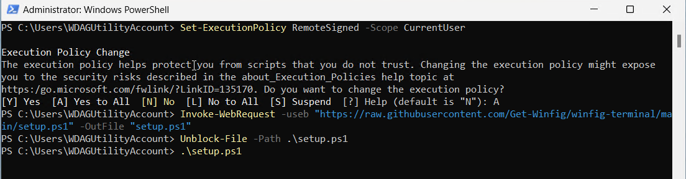

<h1 align="center">AutoHotkey: Winfig Dots Custom Hotkeys & Automation</h1>


<div align="center">
  <strong>Part of the Winfig Dots ecosystem for seamless Windows customization and productivity</strong>
</div>

---

## Overview

**AutoHotkey** is a powerful scripting language for Windows automation, hotkeys, and workflow customization. With Winfig Dots, you get a curated set of ergonomic, productivity-focused hotkeys for window management, terminal launching, and seamless integration with tiling managers and automation tools.

---

## Features

- Fast, ergonomic hotkeys for window and workspace management
- One-touch restart/reload for whkd, komorebic, and yasbc
- Quick launch for Windows Terminal and WSL
- Minimize all windows except the active one
- Close focused window instantly
- Designed for seamless integration with Winfig Dots and tiling managers

---


## Requirements

- [x] [AutoHotkey v2.0+](https://www.autohotkey.com/) installed on Windows 11
- [x] [PowerShell 5+](https://github.com/PowerShell/PowerShell) for automation and scripting
- [x] [Git](https://git-scm.com/download/win) for Git gutter integration (optional)
- [x] Administrator privileges for certain configurations
- [x] Internet access for downloading dependencies

!!! tip "Quick Install"
    - **AutoHotkey:**
      `winget install --id AutoHotkey.AutoHotkey -e`
    - **Git:**
      `winget install --id Git.Git -e`
    - **PowerShell 7 (optional, recommended):**
      `winget install --id Microsoft.Powershell -e`

---

## Installation Methods

=== "Web Install (Recommended)"

  **One-line installation** - Downloads and runs automatically:

    ```powershell title="Run in Administrative PowerShell"
    Invoke-RestMethod -useb https://raw.githubusercontent.com/Get-Winfig/winfig-dots/refs/heads/main/AHK/setup.ps1 | Invoke-Expression
    ```

    !!! success "Why Web Install?"
        - Always gets the latest version
        - No manual download required
        - Automatic script verification
    

=== "Local Install"

    **Download and run manually** for offline environments:

    ```powershell title="1. Set Execution Policy"
    Set-ExecutionPolicy RemoteSigned -Scope CurrentUser
    ```

    ```powershell title="2. Download Script"
    # Download from GitHub
    Invoke-WebRequest -useb "https://raw.githubusercontent.com/Get-Winfig/winfig-dots/refs/heads/main/AHK/setup.ps1" -OutFile "setup.ps1"
    ```

    ```powershell title="3. Unblock and Run"
    Unblock-File -Path .\setup.ps1
    .\setup.ps1
    ```

    !!! warning "Note"
        - Ensure you have the latest script version
        - Manual updates required for new releases
        - Verify script integrity before running
    

---

## Usage

All hotkeys are active as soon as the script is running. You can edit the script to add, remove, or change hotkeys as needed. For advanced automation, combine these hotkeys with your tiling manager or other Winfig Dots tools.

### Hotkey Quick Reference

| Hotkey                        | Action/Description                                 |
|-------------------------------|----------------------------------------------------|
| <kbd>Alt</kbd> + <kbd>O</kbd>             | Restart whkd (tiling window manager)              |
| <kbd>Alt</kbd> + <kbd>Shift</kbd> + <kbd>O</kbd> | Reload komorebic configuration                    |
| <kbd>Alt</kbd> + <kbd>Ctrl</kbd> + <kbd>O</kbd>  | Reload yasbc                                      |
| <kbd>Win</kbd> + <kbd>F2</kbd>            | Toggle komorebic shortcuts                        |
| <kbd>Alt</kbd> + <kbd>W</kbd>             | Close active/focused window/app                   |
| <kbd>Win</kbd> + <kbd>T</kbd>             | Open Windows Terminal                             |
| <kbd>Win</kbd> + <kbd>K</kbd>             | Open Windows Terminal with WSL                    |
| <kbd>Alt</kbd> + <kbd>M</kbd>             | Minimize all except active window                 |

---

## Configuration Highlights

- All hotkeys use AutoHotkey v2.0+ syntax for reliability and performance
- Designed for minimal conflicts with other shortcuts
- Easily extensible: add your own hotkeys or automation blocks
- Integrates with PowerShell, whkd, komorebi, yasbc, and Windows Terminal

---


## Frequently Asked Questions (FAQ)

??? question "How do I add or change hotkeys?"
    Edit the script in any text editor. Use the [AutoHotkey documentation](https://www.autohotkey.com/docs/v2/) for syntax help.

??? question "How do I make the script run at startup?"
    Place a shortcut to your script in the Windows Startup folder (`shell:startup`).

??? question "Can I use these hotkeys with other automation tools?"
    Yes! These hotkeys are designed to work alongside Winfig Dots, whkd, komorebi, and other automation tools.

??? question "How do I reload or restart the script?"
    Right-click the AHK tray icon and choose Reload Script, or double-click the script again.

---

## Troubleshooting

| Issue                          | Solution                                                                 |
|---------------------------------|--------------------------------------------------------------------------|
| Hotkey not working             | Make sure AutoHotkey v2.0+ is installed and script is running.            |
| Conflicting shortcut           | Change the hotkey in the script to avoid conflicts.                       |
| Integration not working        | Ensure whkd, komorebi, or yasbc are installed and in your PATH.           |
| Script errors                  | Check the AHK syntax and use the v2.0+ documentation for reference.       |

If your issue isn’t listed, check the [AutoHotkey documentation](https://www.autohotkey.com/docs/v2/) or [Winfig GitHub Issues](https://github.com/Get-Winfig/winfig-docs/issues).
