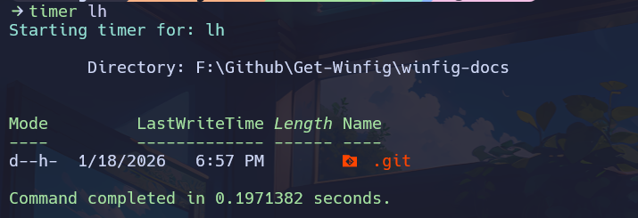
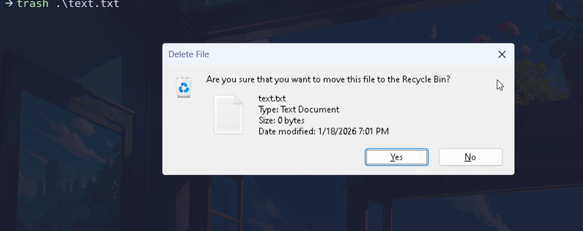

<h1 align="center">PowerShell: Winfig Dots Automation & Productivity Profile</h1>


<div align="center">
  <strong>Part of the Winfig Dots ecosystem for seamless Windows customization and productivity</strong>
</div>

---

## Overview

**Winfig PowerShell Profile** is a modern, modular, and highly customizable PowerShell environment for Windows automation, productivity, and developer workflows. It brings together advanced functions, ergonomic aliases, beautiful prompt theming, and seamless integration with tools like fzf, bat, and git.

---

## Features

- **Custom keybindings** for navigation and history
- **fzf integration** for interactive selection
- **Command-not-found** suggestions with winget
- **Unified server launcher** for dev servers
- **Smart timer** for command timing
- **Modern trash** (safe delete)
- **Hastebin uploader** with preview
- **Weather & network info** commands
- **One-command update/upgrade**
- **Colorful, informative output**
- **Handy aliases** for frequent tasks

---
## Requirements

- [x] [PowerToys](https://docs.microsoft.com/powertoys/) installed on Windows 11
- [x] [PowerShell 5+](https://github.com/PowerShell/PowerShell) for automation and scripting
- [x] [Git](https://git-scm.com/download/win) installed for dotfile management
- [x] Administrator privileges for certain configurations
- [x] Internet access for downloading dependencies
- [x] [Nerd Fonts (Hack Nerd Font)](https://github.com/ryanoasis/nerd-fonts/releases/download/v3.4.0/Hack.zip) for enhanced terminal and UI appearance

!!! tip "Quick Install"
    - **PowerShell 7:**
        `winget install --id Microsoft.Powershell -e`
    - **Git:**
        `winget install --id Git.Git -e`
    - **PowerShell 7 (optional, recommended):**
        `winget install --id Microsoft.Powershell -e`
     - **fzf:**
        `winget install --id Junegunn.fzf -e`
    - **bat:**
        `winget install --id sharkdp.bat -e`
    - **Hack Nerd Fonts:**
        Download from [Nerd Fonts](https://github.com/ryanoasis/nerd-fonts/releases/download/v3.4.0/Hack.zip) and install your favorite patched font.

---

## Installation Methods

=== "Web Install (Recommended)"

    **One-line installation** - Downloads and runs automatically:

    ```powershell title="Run in Administrative PowerShell"
    Invoke-RestMethod -useb https://raw.githubusercontent.com/Get-Winfig/winfig-dots/refs/heads/main/Powershell/setup.ps1 | Invoke-Expression
    ```

    !!! success "Why Web Install?"
        - Always gets the latest version
        - No manual download required
        - Automatic script verification
    

=== "Local Install"

    **Download and run manually** for offline environments:

    ```powershell title="1. Set Execution Policy"
    Set-ExecutionPolicy RemoteSigned -Scope CurrentUser
    ```

    ```powershell title="2. Download Script"
    # Download from GitHub
    Invoke-WebRequest -useb "https://raw.githubusercontent.com/Get-Winfig/winfig-dots/refs/heads/main/Powershell/setup.ps1" -OutFile "setup.ps1"
    ```

    ```powershell title="3. Unblock and Run"
    Unblock-File -Path .\setup.ps1
    .\setup.ps1
    ```

    !!! warning "Note"
        - Ensure you have the latest script version
        - Manual updates required for new releases
        - Verify script integrity before running
    

---

## Post-Installation

After installation, follow these steps:

1. **Reload Profile:**
    ```powershell
    . $PROFILE
    ```
2. **Test Key Features:**
    - Try aliases (e.g., `hb`, `zi`)
    - Use functions like `server`, `timer`, `trash`, `hastebin`
    - Check fuzzy search (fzf) and color output (bat)
3. **Customize:**
    - Edit or add functions in `functions/`
    - Add aliases in `Aliases.ps1`
    - Adjust config in `Config/`
4. **Update Regularly:**
    - Pull latest changes and rerun `setup.ps1` as needed
5. **Troubleshoot:**
    - If something doesn't work, check the Troubleshooting section below

---

## Tips & Usage Notes

- [x] Use a Nerd Font in your terminal for best icon and prompt appearance.
- [x] Customize your prompt, colors, and banners in the Config folder.
- [x] Reload your profile with `. $PROFILE` after making changes.
- [x] Keep your tools (fzf, bat, git, PowerShell) up to date for best compatibility.
- [x] Review and edit modular config files for easy personalization.
- [x] The setup script is safe to re-run for updates or repairs.
- [x] For advanced tweaks, explore the Initialize.ps1 and Config scripts.

---

## Functions


### server

!!! info "Purpose"
    Launch a local development server (Node.js, Python, Hugo, PHP, etc.) with fuzzy selection, service preview, and custom port/path options.

=== "Usage"
    ```powershell title="Start a server (choose type interactively)"
    server
    ```
    ```powershell title="Start a Python server on port 8080"
    server python 8080
    ```

!!! tip "How it works"
    - Uses <kbd>fzf</kbd> for interactive selection
    - Previews service details before launch
    - Supports custom ports and paths


### timer

!!! info "Purpose"
    Time the execution duration of any command or script, displaying the result in seconds.

=== "Usage"
    ```powershell title="Time a script or command"
    timer { Get-Process }
    ```
    ```powershell title="Time a file copy"
    timer { Copy-Item file.txt D:\Backup }
    ```

!!! tip "How it works"
    - Accepts any command as input
    - Shows a colorized summary of execution time



### trash

!!! info "Purpose"
    Move files or directories to the Windows Recycle Bin using the Shell COM object.

=== "Usage"
    ```powershell title="Move a file to the Recycle Bin"
    trash file.txt
    ```
    ```powershell title="Move a folder to the Recycle Bin"
    trash .\old_folder
    ```

!!! tip "How it works"
    - Provides feedback on success or failure



### hastebin

!!! info "Purpose"
    Upload file content to Hastebin, with interactive file selection and live preview using fzf and bat.

=== "Usage"
    ```powershell title="Upload a file to Hastebin (interactive picker)"
    hastebin
    ```
    ```powershell title="Pipe command output to Hastebin"
    Get-Content script.ps1 | hastebin
    ```

!!! tip "How it works"
    - Uses <kbd>fzf</kbd> and <kbd>bat</kbd> for selection and preview
    - Copies the resulting URL to your clipboard


### networkinfo

!!! info "Purpose"
    Display detailed network information for the current system.

=== "Usage"
    ```powershell title="Show all network details"
    networkinfo
    ```

!!! tip "How it works"
    - Shows IP addresses, adapters, and more


### weather

!!! info "Purpose"
    Fetch and display the current weather for your configured location.

=== "Usage"
    ```powershell title="Show weather for your default location"
    weather
    ```
    ```powershell title="Show weather for a specific city"
    weather "New York"
    ```

!!! tip "How it works"
    - Requires internet connection


### update

!!! info "Purpose"
    Check for available updates for winget, chocolatey, and PowerShell modules, displaying a clear summary.

=== "Usage"
    ```powershell title="List all available updates"
    update
    ```

!!! tip "How it works"
    - Does not install updates, only lists them


### upgrade

!!! info "Purpose"
    Install all available updates for winget, chocolatey, and PowerShell modules.

=== "Usage"
    ```powershell title="Upgrade everything in one go"
    upgrade
    ```

!!! tip "How it works"
    - Provides a summary of updated packages and modules

!!! warning "Usage Tips"
    - All functions are modular and can be called directly (e.g., `server`, `timer`, `trash`).
    - For detailed help, run:
        ```powershell
            Get-Help <FunctionName>
        ```
        (Requires comment-based help in the function script.)

---

## Aliases

Below are the most useful and productivity-boosting aliases and functions included in your profile. All aliases are modular and can be customized in `Aliases.ps1`.

---

### Git Shortcuts

| Alias/Function | Description                        | Usage Example                        |
|:--------------:|:-----------------------------------|:-------------------------------------|
| gst            | Git status                         | `gst`                                |
| gbr            | Git branch                         | `gbr`                                |
| gcomit         | Git commit                         | `gcomit`                             |
| gcmmit         | Git commit with message            | `gcmmit "Initial commit"`            |
| gammend        | Git commit --amend                 | `gammend`                            |
| gamendnm       | Git commit --amend --no-edit       | `gamendnm`                           |
| glog           | Git log                            | `glog`                               |
| gdf            | Git diff                           | `gdf`                                |
| gpull          | Git pull                           | `gpull`                              |
| gfetch         | Git fetch                          | `gfetch`                             |
| gpush          | Git push                           | `gpush`                              |
| gad            | Git add all changes                | `gad`                                |
| gcl            | Git clone                          | `gcl https://github.com/user/repo.git`|
| guncommit      | Undo last commit, keep changes     | `guncommit`                          |
| gcheckout      | Checkout new branch                | `gcheckout feature-x`                |

---

### Tig Shortcuts

| Alias/Function | Description         | Usage Example |
|:--------------:|:-------------------|:--------------|
| t              | Launch tig         | `t`           |
| tb             | Tig blame          | `tb`          |
| tst            | Tig status         | `tst`         |
| tlog           | Tig log            | `tlog`        |
| tdf            | Tig diff           | `tdf`         |

---

### System & Info

| Alias/Function | Description         | Usage Example |
|:--------------:|:-------------------|:--------------|
| sysinfo        | Show system info   | `sysinfo`     |
| myip           | Show public IP     | `myip`        |
| localip        | Show local IP      | `localip`     |
| flushdns       | Flush DNS cache    | `flushdns`    |
| path           | List PATH entries  | `path`        |

---

### File & Directory Navigation

| Alias/Function | Description                | Usage Example         |
|:--------------:|:--------------------------|:---------------------|
| ..             | Go up one directory        | `..`                 |
| ...            | Go up two directories      | `...`                |
| ....           | Go up three directories    | `....`               |
| mkcd           | Make and cd into directory | `mkcd MyFolder`      |
| edit-here      | Open current dir in VS Code| `edit-here`          |
| here           | Open current dir in Explorer| `here`              |

---

### File Operations

| Alias/Function | Description                        | Usage Example         |
|:--------------:|:-----------------------------------|:---------------------|
| touch          | Create empty file                  | `touch file.txt`     |
| la             | List all files (PowerColorLS)      | `la`                 |
| ll             | Long list with sizes               | `ll`                 |
| lf             | List only files                    | `lf`                 |
| ld             | List only directories              | `ld`                 |
| lh             | List hidden files                  | `lh`                 |
| back           | Go to previous directory           | `back`               |
| lastmod        | 5 most recently modified files     | `lastmod`            |
| oldest         | 5 oldest files                    | `oldest`             |
| recent         | 5 most recently accessed files     | `recent`             |

---

### Process & System Control

| Alias/Function | Description                | Usage Example         |
|:--------------:|:--------------------------|:---------------------|
| pkill          | Kill process by name       | `pkill notepad`      |
| clr            | Clear console              | `clr`                |
| reload         | Reload profile             | `reload`             |
| edit-profile   | Edit profile in VS Code    | `edit-profile`       |

---

### File Content Helpers

| Alias/Function | Description                | Usage Example         |
|:--------------:|:--------------------------|:---------------------|
| head           | Show first n lines         | `head file.txt 20`   |
| tail           | Show last n lines (follow) | `tail file.txt 20 -f`|

---

### Hashing

| Alias/Function | Description                | Usage Example         |
|:--------------:|:--------------------------|:---------------------|
| md5            | MD5 hash of file           | `md5 file.txt`       |
| sha1           | SHA1 hash of file          | `sha1 file.txt`      |
| sha256         | SHA256 hash of file        | `sha256 file.txt`    |

---

### Utility & Misc

| Alias/Function | Description                | Usage Example         |
|:--------------:|:--------------------------|:---------------------|
| which          | Find command path          | `which git`          |
| open           | Open file or dir           | `open file.txt`      |
| edit           | Edit file(s) in VS Code    | `edit file.txt`      |

---

### External Tools Aliases

| Alias         | Description                                 | Usage Example                |
|:-------------:|:--------------------------------------------|:----------------------------|
| cat           | Alias for bat.exe (PowerShell 7+)           | `cat file.txt`              |
| h             | Alias for Get-History (PowerShell 7+)       | `h`                         |
| grep          | Alias for Select-String                     | `grep "pattern" file.txt`   |
| lg            | Launch LazyGit                              | `lg`                        |
| htop          | Launch NTop                                 | `htop`                      |
| neofetch      | Launch FastFetch                            | `neofetch`                  |
| view          | Preview Markdown with Glow                  | `view README.md`            |
| j             | Zoxide jump                                 | `j folder`                  |
| ji            | Zoxide interactive                          | `ji`                        |
| sudo          | Windows sudo (gsudo.exe)                    | `sudo notepad`              |
| gitfetch      | Onefetch for git stats                      | `gitfetch`                  |

---

### Custom Locations

| Alias/Function      | Description                | Usage Example         |
|:-------------------:|:--------------------------|:---------------------|
| Dotfiles            | Go to Dotfiles dir         | `Dotfiles`           |
| TEMP                | Go to TEMP dir             | `TEMP`               |
| Desktop             | Go to Desktop              | `Desktop`            |
| Documents           | Go to Documents            | `Documents`          |
| UserProfile         | Go to UserProfile          | `UserProfile`        |
| Downloads           | Go to Downloads            | `Downloads`          |
| Pictures            | Go to Pictures             | `Pictures`           |
| Videos              | Go to Videos               | `Videos`             |
| ShareXScreenshots   | Go to ShareX screenshots   | `ShareXScreenshots`  |

---

### Miscellaneous Utilities

| Alias/Function | Description                | Usage Example         |
|:--------------:|:--------------------------|:---------------------|
| man            | Show full help for command | `man Get-ChildItem`  |
| file           | Show basic file info       | `file file.txt`      |
| winutil        | Run WinUtil full-release   | `winutil`            |
| winutildev     | Run WinUtil dev-release    | `winutildev`         |

---

!!! tip "Customization"
    - All aliases are defined in `Aliases.ps1` and can be edited or extended.
    - Use `Get-Alias` or `Get-Command` to explore more.

---

## Frequently Asked Questions (FAQ)

??? question "Can I use my own PowerShell profile or dotfiles?"
    Yes! Back up your current profile before applying Winfig dotfiles. You can always merge or restore your customizations later.

??? question "Is it safe to run these scripts?"
    All scripts and configs are open source. Review them on [GitHub](https://github.com/Get-Winfig/winfig-dots) before running.

??? question "How do I update my PowerShell profile?"
    Pull the latest changes from the repo and re-run `setup.ps1`.

??? question "How do I reload the profile after editing?"
    Run `. $PROFILE` or `reload` in your PowerShell session.

??? question "How do I add my own functions or aliases?"
    Place new scripts in `functions/` or add aliases to `Aliases.ps1`, then reload the profile.

??? question "What if I use both PowerShell 5 and 7?"
    The setup script configures both versions automatically. You can use the same dotfiles for both.

---

## Troubleshooting

| Issue                          | Solution                                                                 |
|---------------------------------|--------------------------------------------------------------------------|
| Profile changes not loading     | Run `. $PROFILE` to reload the profile.                                   |
| fzf or bat not found            | Ensure they are installed and in your PATH.                               |
| Aliases/functions not working   | Check for typos and reload the profile.                                   |
| Script errors during setup      | Run PowerShell as Administrator and check execution policy.               |
| Encoding issues                 | Make sure your terminal uses UTF-8 encoding.                              |
| Module install errors           | Use `Install-Module -Scope CurrentUser` and check your internet connection.|

If your issue isn’t listed, check the [Winfig Dots Issues](https://github.com/Get-Winfig/winfig-docs/issues) or open a new issue for help.
