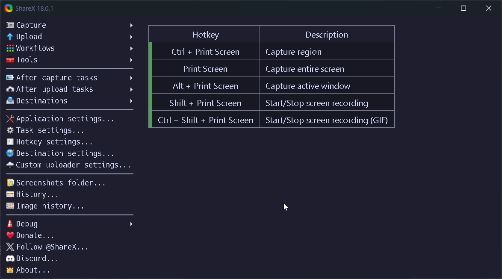

<h1 align="center">ShareX: Effortless Screenshot & Capture Automation</h1>


<div align="center">
  <strong>Part of the Winfig Dots ecosystem for seamless Windows customization and productivity</strong>
</div>

---

## Overview

**ShareX** is a powerful, open-source screenshot and screen recording tool for Windows.
With Winfig’s curated ShareX dotfiles, you get a pre-configured setup for fast, consistent, and automated captures—perfect for documentation, sharing, and productivity.

---

## Features

- **Custom Hotkeys:** Instantly capture regions, windows, or the entire screen.
- **Automated Workflows:** Auto-upload, copy to clipboard, or save to custom folders.
- **Image Editing:** Built-in editor for quick annotations and highlights.
- **GIF & Video Capture:** Record your screen as GIFs or videos with one click.
- **Cloud Integration:** Seamless uploads to Imgur, Dropbox, Google Drive, and more.

---
## Requirements

- [x] [ShareX](https://getsharex.com/) installed on Windows 11
- [x] [PowerShell 5+](https://github.com/PowerShell/PowerShell) for automation and scripting
- [x] [Git](https://git-scm.com/download/win) installed for dotfile management
- [x] Administrator privileges for certain configurations
- [x] Internet access for downloading dependencies
- [x] [Nerd Fonts (FiraCode)](https://github.com/ryanoasis/nerd-fonts/releases/download/v3.4.0/FiraCode.zip) for enhanced terminal and UI appearance

!!! tip "Quick Install"
    - **ShareX:**
      `winget install --id ShareX.ShareX -e`
    - **Git:**
      `winget install --id Git.Git -e`
    - **PowerShell 7 (optional, recommended):**
      `winget install --id Microsoft.Powershell -e`
    - **FiraCode Nerd Fonts:**
      Download from [Nerd Fonts](https://github.com/ryanoasis/nerd-fonts/releases/download/v3.4.0/FiraCode.zip) and install your favorite patched font.

!!! note "Why Nerd Fonts?"
    Nerd Fonts provide extra icons and glyphs, making your ShareX menus and scripts look cleaner and more readable—especially if you use terminal-based workflows.

!!! info "Administrator Privileges"
    Some advanced ShareX automations or integrations (like custom uploaders or scripting) may require you to run ShareX or PowerShell as an administrator.

---

## Dotfiles Structure

Your ShareX dotfiles are organized for modularity and easy customization:

- **ApplicationConfig.json:** Core ShareX settings for UI, workflows, and preferences.
- **HotkeysConfig.json:** Default ShareX keymaps (no custom remapping; uses ShareX defaults for familiarity).
- **UploadersConfig.json:** Pre-configured upload destinations and automation.
- **themes/**: Ready-to-use ShareX themes for a personalized look.
- **ImageEffects/**: Custom image effects for screenshots (macOS, Ubuntu, Windows styles, and more).
- **ShareX-backup.sxb:** Backup of Winfig settings for easy restore.

---

## Installation Methods

=== "Web Install (Recommended)"

    **One-line installation** - Downloads and runs automatically:

    ```powershell title="Run in Administrative PowerShell"
    Invoke-RestMethod -useb https://raw.githubusercontent.com/Get-Winfig/winfig-dots/main/ShareX/setup.ps1 | Invoke-Expression
    ```

    !!! success "Why Web Install?"
        - Always gets the latest version
        - No manual download required
        - Automatic script verification
    

=== "Local Install"

    **Download and run manually** for offline environments:

    ```powershell title="1. Set Execution Policy"
    Set-ExecutionPolicy RemoteSigned -Scope CurrentUser
    ```

    ```powershell title="2. Download Script"
    # Download from GitHub
    Invoke-WebRequest -useb "https://raw.githubusercontent.com/Get-Winfig/winfig-dots/main/ShareX/setup.ps1" -OutFile "setup.ps1"
    ```

    ```powershell title="3. Unblock and Run"
    Unblock-File -Path .\setup.ps1
    .\setup.ps1
    ```

    !!! warning "Note"
        - Ensure you have the latest script version
        - Manual updates required for new releases
        - Verify script integrity before running
    

---

## Post-Installation

1. **Restart ShareX** to apply new settings.
2. **Test a Screenshot:** Use your hotkey (e.g., <kbd>Print Screen</kbd>) and confirm the workflow (auto-upload, copy, etc.).
3. **Review Hotkeys:** Go to `Hotkey Settings` in ShareX to see or change shortcuts.
4. **Customize Workflows:** Adjust destinations, after-capture tasks, or add your own automations as needed.
5. **Backup:** Consider exporting your settings for future use or sharing.

!!! info "Need Help?"
    - Visit the [ShareX documentation](https://getsharex.com/docs/) for advanced features.
    - [Open an issue](https://github.com/Get-Winfig/winfig-docs/issues) if you encounter problems with the Winfig setup.



---


## Tips & Usage Notes

- **Default Keymaps:** Winfig ShareX dotfiles use the official ShareX default keymaps for familiarity and ease of use.
- **Image Effects:** Access custom effects from the ShareX image editor for quick styling.
- **Themes:** Switch between included themes in ShareX for a look that matches your desktop.
- **Safe Customization:** All configs are modular—feel free to tweak or extend as you like!

---

## Keymaps

| Hotkey                        | Description                          |
|-------------------------------|--------------------------------------|
| Ctrl + Print Screen           | Capture region                       |
| Print Screen                  | Capture entire screen                |
| Alt + Print Screen            | Capture active window                |
| Shift + Print Screen          | Start/Stop screen recording          |
| Ctrl + Shift + Print Screen   | Start/Stop screen recording (GIF)    |

> *These are the ShareX defaults. You can view or change them in ShareX > Hotkey Settings.*

---

## Frequently Asked Questions (FAQ)

??? question "Can I use my own ShareX settings?"
    Yes! Back up your current settings before applying Winfig dotfiles. You can always restore or merge your preferences later.

??? question "Is this safe to use?"
    All scripts and configs are open source. Review them on [GitHub](https://github.com/Get-Winfig/winfig-dots) before running.

??? question "How do I update my ShareX dotfiles?"
    Simply re-run the web install command to fetch and apply the latest version.

---

## Troubleshooting

| Issue                          | Solution                                                                 |
|---------------------------------|--------------------------------------------------------------------------|
| Hotkeys not working             | Check for conflicts with other apps or reassign in ShareX Hotkey Settings.|
| Uploads failing                 | Verify your internet connection and destination account settings.         |
| Settings not applied            | Ensure you replaced the correct `Settings.json` and restarted ShareX.     |
| Script errors during install    | Run PowerShell as Administrator and check execution policy.               |

If your issue isn’t listed, check the [ShareX FAQ](https://getsharex.com/docs/) or [Winfig GitHub Issues](https://github.com/Get-Winfig/winfig-docs/issues).
