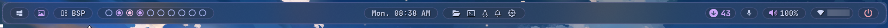

<h1 align="center">YASB: Yet Another Status Bar for Windows</h1>


<div align="center">
  <strong>Part of the Winfig Dots ecosystem for seamless Windows customization and productivity</strong>
</div>

---

## Overview

**YASB** (Yet Another Status Bar) is a highly customizable, modern status bar for Windows desktops, designed for seamless integration with Komorebi, whkd, and the Winfig Dots ecosystem. YASB provides beautiful widgets, workspace indicators, system stats, and more all styled with Catppuccin Mocha colors and advanced blur effects.

---

## Features

- Beautiful, animated status bar with blur, acrylic, and rounded corners
- Catppuccin Mocha color palette for a modern look
- Modular widgets: workspaces, layouts, clock, volume, wifi, power, wallpaper, apps, and more
- Full integration with Komorebi for workspace and layout display
- Customizable widget placement (left, center, right)
- Gallery wallpaper widget with blur and lazy loading
- System controls: power menu, update checker, microphone, volume, wifi
- Fast, extensible YAML config and CSS theming

---


## Requirements

- [x] [YASB](https://github.com/yasb-bar/yasb) (latest release)
- [x] [Komorebi](https://github.com/LGUG2Z/komorebi) for workspace/layout integration
- [x] [whkd](https://github.com/whkd/whkd) for hotkey handling (optional)
- [x] [PowerShell 5+](https://github.com/PowerShell/PowerShell) for scripting
- [x] Windows 11 (recommended)
- [x] [Nerd Font](https://www.nerdfonts.com/) for icons and symbols
- [x] Administrator privileges for installation

!!! tip "Quick Install"
    - **YASB:**
      `winget install --id AmN.yasb -e`
    - **Komorebi:**
      `winget install --id LGUG2Z.Komorebi -e`
    - **whkd:**
      `winget install --id LGUG2Z.whkd -e`
    - **Git:**
      `winget install --id Git.Git -e`
    - **PowerShell 7 (optional, recommended):**
      `winget install --id Microsoft.Powershell -e`
    - **Nerd Font:**
      Download and install from [Nerd Fonts](https://www.nerdfonts.com/font-downloads)

---

## Installation Methods

=== "Web Install (Recommended)"

  **One-line installation** - Downloads and runs automatically:

    ```powershell title="Run in Administrative PowerShell"
    Invoke-RestMethod -useb https://raw.githubusercontent.com/Get-Winfig/winfig-dots/refs/heads/main/YASB/setup.ps1 | Invoke-Expression
    ```

    !!! success "Why Web Install?"
        - Always gets the latest version
        - No manual download required
        - Automatic script verification
    

=== "Local Install"

    **Download and run manually** for offline environments:

    ```powershell title="1. Set Execution Policy"
    Set-ExecutionPolicy RemoteSigned -Scope CurrentUser
    ```

    ```powershell title="2. Download Script"
    # Download from GitHub
    Invoke-WebRequest -useb "https://raw.githubusercontent.com/Get-Winfig/winfig-dots/refs/heads/main/YASB/setup.ps1" -OutFile "setup.ps1"
    ```

    ```powershell title="3. Unblock and Run"
    Unblock-File -Path .\setup.ps1
    .\setup.ps1
    ```

    !!! warning "Note"
        - Ensure you have the latest script version
        - Manual updates required for new releases
        - Verify script integrity before running
    

---

## Widget Reference

YASB supports a wide range of widgets. Here are the main ones from your config:

| Widget                  | Description                                                      |
|-------------------------|------------------------------------------------------------------|
| home                    | Home menu with quick folders and system menu                     |
| wallpaper / wallpapers  | Wallpaper gallery with blur, gallery, and auto-change            |
| komorebi_workspaces     | Komorebi workspace indicator with icons and animation            |
| komorebi_active_layout  | Komorebi layout indicator with icons and layout switching        |
| clock                   | Clock with calendar popup and multiple timezones                 |
| power_menu              | Power menu (shutdown, restart, sleep, lock, etc.)               |
| update_check            | Windows and winget update checker                                |
| wifi                    | Wifi status and menu                                             |
| volume                  | Volume control and audio menu                                    |
| microphone              | Microphone mute/unmute and level                                 |
| apps                    | Quick launch for favorite apps                                   |


---

## Customization Tips

- Edit `config.yaml` to add, remove, or rearrange widgets
- Tweak `styles.css` for colors, blur, and rounded corners
- Use Nerd Fonts for best icon support
- Adjust widget options for animation, icons, and layout
- Combine with Komorebi for full tiling/desktop integration

---

## Frequently Asked Questions (FAQ)

??? question "How do I add or remove widgets?"
    Edit the `widgets` section in your `config.yaml` and restart YASB.

??? question "How do I change the bar's appearance?"
    Edit `styles.css` for colors, blur, and border radius. Reload YASB to apply changes.

??? question "How do I make YASB start automatically?"
    Place a shortcut to YASB in the Windows Startup folder (`shell:startup`).

??? question "How do I integrate with Komorebi?"
    Ensure Komorebi is running and configured in `config.yaml`. Use the Komorebi widgets for workspace/layout display.

??? question "How do I troubleshoot widget issues?"
    Check the YASB logs and ensure your config and CSS are valid. Refer to the YASB documentation for widget-specific options.

---

## Troubleshooting

| Issue                          | Solution                                                                 |
|---------------------------------|--------------------------------------------------------------------------|
| Bar not showing                | Ensure YASB is running and config is valid. Check logs for errors.        |
| Widget not working             | Check widget config and options in `config.yaml`.                         |
| Icons not displaying           | Make sure Nerd Font is installed and selected in CSS.                     |
| Blur/rounding not applied      | Check `styles.css` and ensure blur/round_corners are enabled.              |
| Komorebi integration missing   | Ensure Komorebi is running and configured in YASB.                        |

If your issue isn’t listed, check the [YASB documentation](https://github.com/yasb-bar/yasb), [Winfig GitHub Issues](https://github.com/Get-Winfig/winfig-docs/issues), or the YASB Discord/Community.

