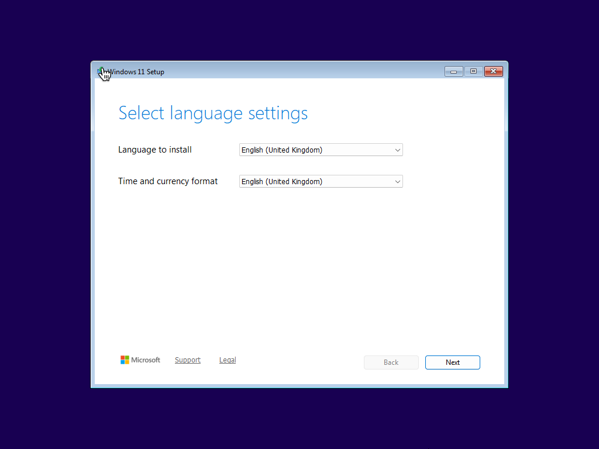
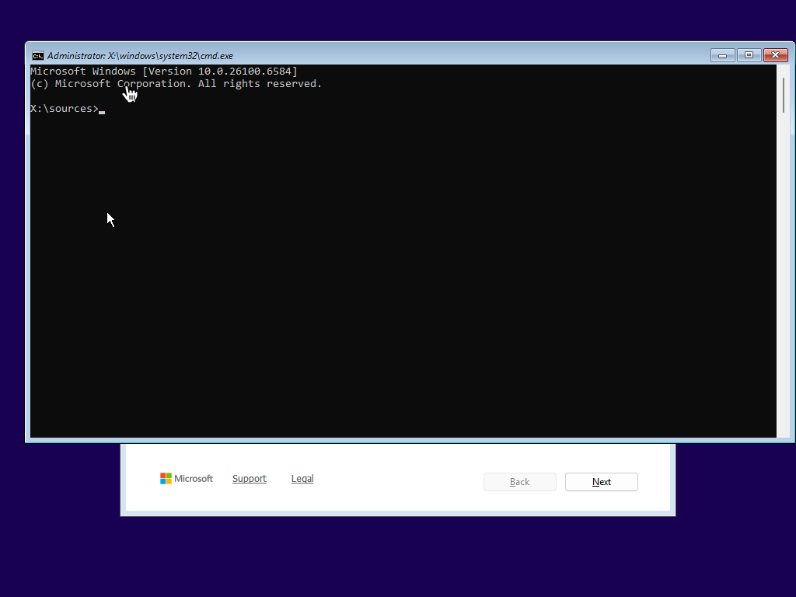
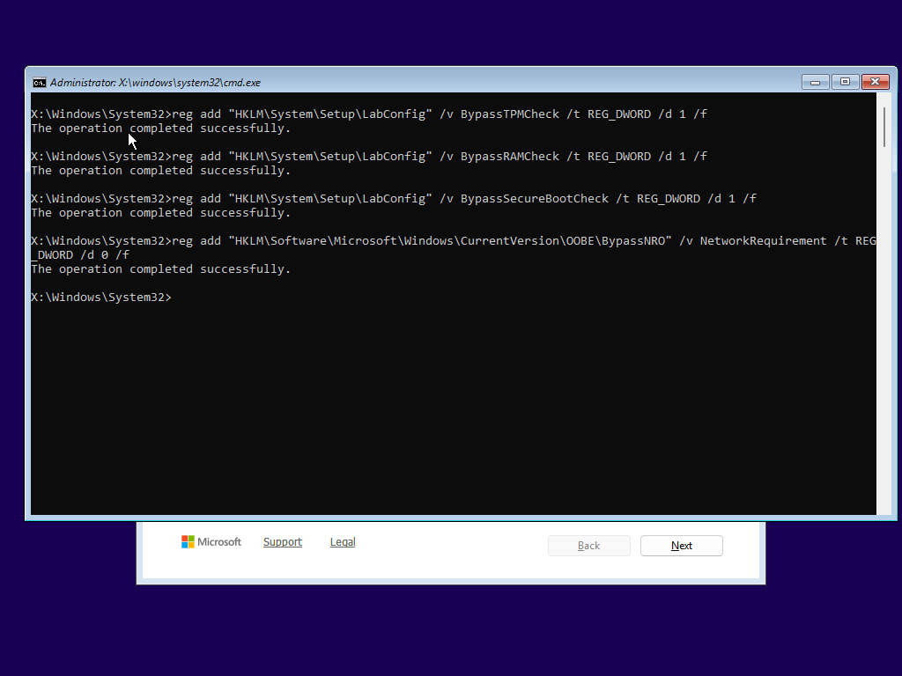
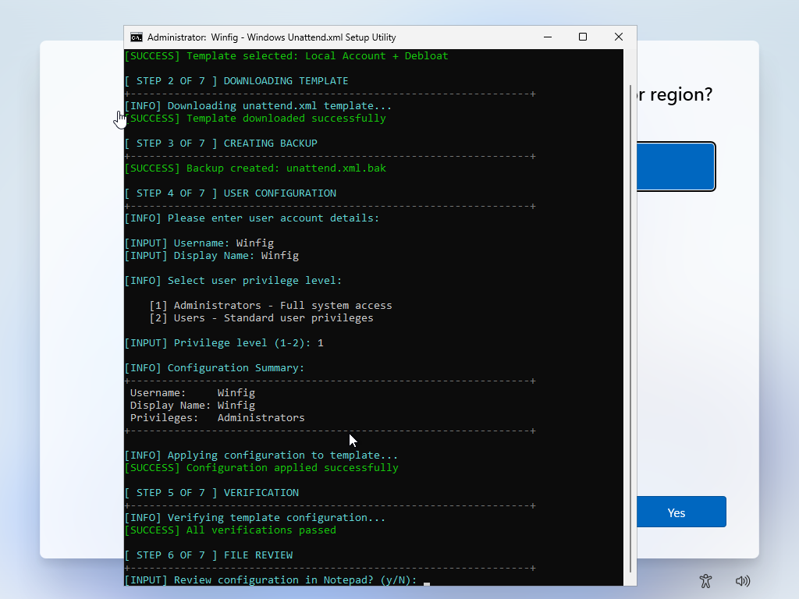

<h1 align="center">Winfig Setup: Install Windows 11</h1>


<div align="center">

  <strong>Complete Windows 11 configuration ecosystem for clean installations and enterprise-ready development environments</strong>
</div>

---


## Overview
The **Winfig Setup** module streamlines Windows 11 installations on a wide range of hardware configurations, including unsupported systems. It automates the installation process while providing options to bypass common restrictions such as TPM 2.0, RAM, CPU, disk space, and Secure Boot requirements.

---

##  Key Features

- [x]  **TPM Bypass** - Install without TPM 2.0 module
- [x]  **RAM Bypass** - Install on systems with <4GB RAM
- [x]  **CPU Bypass** - Install on unsupported CPUs
- [x]  **Disk Space Bypass** - Install on disks with <64GB space
- [x]  **Secure Boot Bypass** - Install on unsupported hardware
- [x]  **Account Freedom** - Create local accounts without Microsoft Account
- [x]  **Custom Installations** - Choose edition, language, and architecture
- [x]  **OOBE Customization** - Bypass Out-Of-Box Experience restrictions
- [x]  **App Removal** - Comprehensive bloatware elimination
- [x]  **Safe Execution** - Only removes existing applications
- [x]  **Logging** - Detailed operation logs for troubleshooting

---

## Getting Started
To use the Winfig Setup module, follow these steps:

### Download the ISO
Obtain a **Windows 11 ISO** from the official Microsoft website:

- [x] Ensure you select the correct **edition** (Home, Pro, or Enterprise) matching your license.
- [x] Save it to a location you can easily access during setup.

### Prepare the Environment
Before starting installation:

- [x] Create a bootable USB drive using tools like **Rufus** or **Ventoy**, or set up a virtual machine (VM) using software like **VMware** or **VirtualBox**.
- [x] Ensure you have **administrator privileges** in the environment.
- [x] Ensure you have a working internet connection for downloading additional scripts during setup.
- [x] Backup any important data, as the installation process may involve formatting drives.

### Start the Installation

- [x] Insert the bootable USB or start the VM.
- [x] Boot from the ISO and follow the on-screen instructions.



### Open Command Prompt

- [x] When you reach the initial setup screen, press `Shift + F10` to open the command prompt.
- [x] This allows you to run **Winfig Setup scripts** and other preparatory commands.
- [x] Ensure you have **administrator privileges** in the environment.



#### Run Bypass Commands
Use the following commands in command prompt as soon as the installation begins:

#### For TPM Bypass:
```bash
    reg add "HKLM\SYSTEM\Setup\LabConfig" /v BypassTPMCheck /t REG_DWORD /d 1 /f
```
#### For RAM Bypass:
```bash
    reg add "HKLM\SYSTEM\Setup\LabConfig" /v BypassRAMCheck /t REG_DWORD /d 1 /f
```
#### For CPU Bypass:
```bash
    reg add "HKLM\SYSTEM\Setup\LabConfig" /v BypassCPUCheck /t REG_DWORD /d 1 /f
```
#### For Secure Boot Bypass:
```bash
    reg add "HKLM\SYSTEM\Setup\LabConfig" /v BypassSecureBootCheck /t REG_DWORD /d 1 /f
```
#### For Disk Space Bypass:
```bash
    reg add "HKLM\SYSTEM\Setup\LabConfig" /v BypassDiskCheck /t REG_DWORD /d 1 /f
```
#### OneLiner (Recommended):
```bash
    reg add "HKLM\SYSTEM\Setup\LabConfig" /v BypassTPMCheck /t REG_DWORD /d 1 /f & reg add "HKLM\SYSTEM\Setup\LabConfig" /v BypassRAMCheck /t REG_DWORD /d 1 /f & reg add "HKLM\SYSTEM\Setup\LabConfig" /v BypassCPUCheck /t REG_DWORD /d 1 /f & reg add "HKLM\SYSTEM\Setup\LabConfig" /v BypassSecureBootCheck /t REG_DWORD /d 1 /f & reg add "HKLM\SYSTEM\Setup\LabConfig" /v BypassDiskCheck /t REG_DWORD /d 1 /f
```
 

### Continue Installation
Close the command prompt and proceed with the installation as usual.

### Finish Installation
Complete the installation to enter OOBE (Out-Of-Box Experience).


### Bypass OOBE Restrictions
During OOBE, press `Shift + F10` again to open command prompt and run the following commands:
```bash
    curl.exe -L -o bypass.cmd https://raw.githubusercontent.com/Get-Winfig/winfig-setup/main/bypass.cmd
```
 

### Execute Bypass Script
Run the downloaded script to bypass OOBE restrictions:
```bash
    bypass.cmd
```
 

### Chose a template
Winfig Setup provides seven pre-configured templates to help you deploy Windows 11 in different environments.
Each template is designed for a specific use case.

Each template includes:

- [x] Custom system configuration (services, policies, and registry)
- [x] Automated debloating rules
- [x] Security or productivity tools
- [x] Optional hardening and privacy enhancements

---

#### Template Overview

| Template Name | Description | Ideal Use Case |
| -------------- | ------------ | --------------- |
| **Local Only**   | Minimal setup with no online accounts. | Users who prefer local accounts and privacy. |
| **Local + Debloated** | Local setup with bloatware apps and services removed. | Power users seeking a streamlined experience. |
| **Microsoft Account + Debloated** | Microsoft Account setup with bloatware removed. | Users wanting a clean Microsoft Account experience. |
| **VmWare Basic** | Basic setup optimized for VMware environments. | IT professionals working with virtual machines. |
| **VmWare + Debloated** | VMware setup with bloatware removed. | Virtual machine users seeking performance and efficiency. |
| **VirtualBox Basic** | Basic setup optimized for VirtualBox environments. | IT professionals working with VirtualBox VMs. |
| **VirtualBox + Debloated** | VirtualBox setup with bloatware removed. | VirtualBox users seeking performance and efficiency. |

---

#### Template Details

Each template applies specific configurations during the Windows 11 installation process.
Select the one that aligns with your environment and workflow to achieve the best balance between **performance**, **privacy**, and **usability**.

---

??? info "1. Local Only"
    **Purpose:**
    This template installs Windows 11 using a **local account only**, completely bypassing the Microsoft Account requirement.
    It provides a clean, privacy-respecting setup ideal for users who prefer full control over their system without any cloud dependency.

    **Key Features:**

    - [x] Creates a local user account during setup
    - [x] Disables Microsoft account prompts and online sign-ins
    - [x] Keeps Windows Store and related services intact

    **Ideal For:**

    - [x] Privacy-focused users
    - [x] Offline environments
    - [x] Analysts and lab setups where isolation is required

---

??? info "2. Local + Debloated"
    **Purpose:**
    Builds on the “Local Only” template with additional **system optimization and bloatware removal**.
    Designed for power users who want Windows 11 to be lightweight, fast, and distraction-free without sacrificing stability.

    **Key Features:**

    - [x] Creates a local user account (no Microsoft login required)
    - [x] Removes unnecessary default apps (Weather, News, Xbox, etc.)
    - [x] Disables background telemetry, Cortana, and ad services
    - [x] Enables classic context menus and removes Microsoft Edge auto-pinning
    - [x] Configures Windows Update and Defender for minimal interference
    - [x] Optional PowerShell module for advanced cleaning after install

    **Ideal For:**

    - [x] Power users and developers
    - [x] Offline or lab environments
    - [x] Users seeking a fast and clutter-free setup

---

??? info "3. Microsoft Account + Debloated"
    **Purpose:**
    Configures Windows 11 with a **Microsoft Account** while still performing a complete debloat and optimization pass.
    Ideal for users who rely on Microsoft services but want a clean, efficient system.

    **Key Features:**

    - [x] Uses Microsoft Account for setup and synchronization
    - [x] Preserves Store functionality and OneDrive integration
    - [x] Removes unnecessary built-in apps and telemetry
    - [x] Retains compatibility with Microsoft 365 and Azure services
    - [x] Applies registry tweaks to reduce background usage
    - [x] Enables productivity-focused optimizations

    **Ideal For:**

    - [x] Users integrated with Microsoft ecosystem
    - [x] Professionals using OneDrive, Office 365, or Outlook
    - [x] Power users who still need Microsoft cloud features

---

??? info "4. VMware Basic"
    **Purpose:**
    Optimizes Windows 11 for smooth operation inside **VMware Workstation or ESXi environments**.
    Ensures stable drivers, reduced resource consumption, and compatibility with virtualized hardware.

    **Key Features:**

    - [x] Enables VMware guest additions (if available)
    - [x] Disables hardware-specific checks (TPM, Secure Boot, etc.)
    - [x] Disables background services unnecessary in virtualized setups
    - [x] Optimizes storage, memory, and I/O performance settings
    - [x] Enables RDP and clipboard sharing by default
    - [x] Adjusts power and sleep settings for continuous lab uptime

    **Ideal For:**

    - [x] Digital Forensics & Cybersecurity students
    - [x] Penetration testing or malware analysis VMs
    - [x] IT professionals maintaining test labs

---

??? info "5. VMware + Debloated"
    **Purpose:**
    Extends the VMware Basic template by removing nonessential components for a **lean, high-performance VM**.
    Best suited for those who use Windows 11 in virtualized environments with limited resources.

    **Key Features:**

    - [x] Includes all VMware Basic optimizations
    - [x] Removes bloatware and non-critical system features
    - [x] Applies performance registry tweaks and service pruning
    - [x] Disables indexing and telemetry inside VM
    - [x] Reduces background memory footprint
    - [x] Preserves networking and shared folder compatibility

    **Ideal For:**

    - [x] DFIR (Digital Forensics & Incident Response) students
    - [x] Researchers and lab operators
    - [x] Professionals who prioritize lightweight, fast virtual machines

---

??? info "6. VirtualBox Basic"
    **Purpose:**
    Provides optimized Windows 11 configurations for **Oracle VirtualBox** environments.
    Focused on stability, compatibility, and smooth operation across VirtualBox versions.

    **Key Features:**

    - [x] Configures Windows for VirtualBox guest drivers and services
    - [x] Disables hardware checks for unsupported setups
    - [x] Optimizes system parameters for limited CPU and RAM usage
    - [x] Enables drag-and-drop, shared clipboard, and auto-resize
    - [x] Disables unnecessary animations for performance improvement

    **Ideal For:**

    - [x] IT and security labs
    - [x] Students learning Windows internals or OS deployment
    - [x] Lightweight testing environments

---

??? info "7. VirtualBox + Debloated"
    **Purpose:**
    Builds upon the VirtualBox Basic setup with additional **debloating and optimization** steps.
    Provides an extremely responsive and efficient VM environment for testing or development.

    **Key Features:**

    - [x] Includes all VirtualBox Basic optimizations
    - [x] Removes unnecessary UWP apps and telemetry services
    - [x] Disables Defender, Cortana, Widgets, and background sync
    - [x] Tweaks registry for better performance and faster boot
    - [x] Reduces CPU load for smoother VirtualBox experience
    - [x] Optional PowerShell automation for cleanup and updates

    **Ideal For:**

    - [x] Developers testing applications inside VirtualBox
    - [x] Students practicing Windows deployment automation
    - [x] Power users maintaining lightweight, persistent virtual systems

---

## Enter Required Information
During the installation process, you may be prompted to enter specific information based on the selected template. This can include:

- [x] Username
- [x] Display Name
- [x] Account Type (User/Administrator)



## Completion

After entering all required configuration details, the setup will finalize and prepare Windows for installation using **Sysprep**.

---

### Review Unattend File
Before continuing, you’ll be prompted:

> **“Would you like to review the generated `unattend.xml` file?”**

- **Yes** → Opens the file in **Notepad** for review or quick edits
- **No** → Skips review and proceeds automatically

---

### Confirm and Proceed
After review, you’ll be asked to confirm:

> **“Proceed with system preparation and installation?”**

Once confirmed:

1. **Sysprep** runs using the generated `unattend.xml`
2. The system reboots into **OOBE**, applying all chosen settings automatically

---

## Disclaimer

- The installation process **may take some time**. Please be patient.
- **Proceed at your own risk**. Ensure you **understand the steps** before continuing.
- The author **is not responsible** for any issues, data loss, or system changes resulting from this process.
- The system will **restart several times** automatically.
- Some **Command Prompt / PowerShell windows** may appear temporarily for system debloating.
- Various **message boxes** may appear during the process.
- A specific message box will prompt you to **set a password** to keep your system secure — do not ignore it.
- Ensure you have a **backup of important data** before proceeding with the installation.
- This tool is intended for **educational and testing purposes only**.
- Always use in compliance with software licensing agreements.
- Modifying system settings can lead to instability; proceed with caution.

