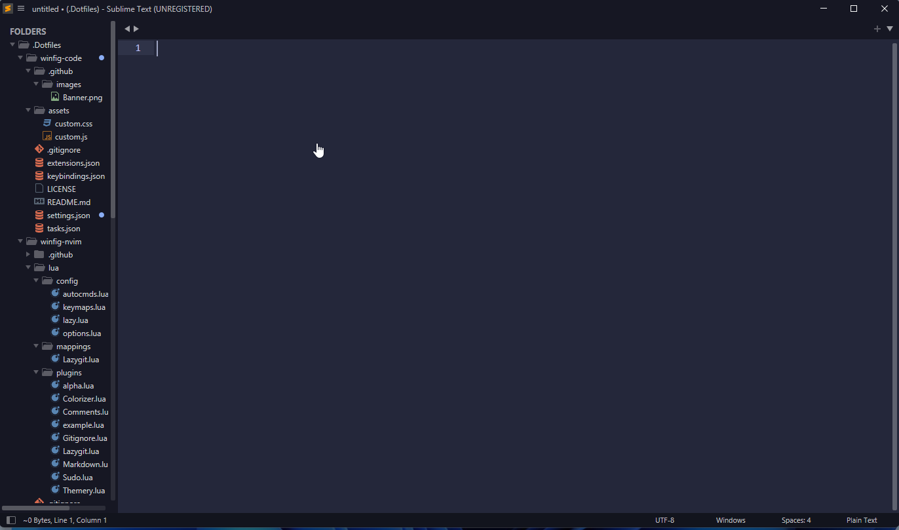

<h1 align="center">Winfig Sublime Text: Highly Customizable Code Editor</h1>


<div align="center">

  <strong>Complete Windows 11 configuration ecosystem for clean installations and enterprise-ready development environments</strong>
</div>

---

## Overview
The **Winfig Subl** is a Sublime Text settings, Themes, and Plugins pack designed to customize and optimize your Sublime Text experience for Windows 11. It consist of a curated set of plugins  that enhance productivity, streamline workflows, and improve the overall development experience on Windows 11.

---

## Features

- [x] **Optimized Settings**: Pre-configured settings tailored for Windows 11 to enhance performance and usability.
- [x] **Curated Plugis**: A selection of essential extensions that improve coding efficiency and add useful functionalities.
- [x] **User-Friendly Configuration**: Easy to install and configure, making it accessible for both beginners and experienced developers.
- [x] **Theming**: Beautiful themes to enhance the visual experience

---

## Requirements

- [x] [Sublime Text](https://www.sublimetext.com) installed on Windows 11.
- [x] [PowerShell 5+](https://github.com/PowerShell/PowerShell)
- [x] [Git](https://git-scm.com/download/win) installed
- [x] Administrator privileges for certain configurations
- [x] Internet access for downloading dependencies
- [x] [Package Control](https://packagecontrol.io/installation) for installing plugins.
- [x] [Nerd Fonts](https://github.com/ryanoasis/nerd-fonts/releases/download/v3.4.0/FiraCode.zip) for enhanced terminal appearance


!!! tip "Quick Install"
    - **Sublime Text:**
      `winget install --id SublimeHQ.SublimeText.4 -e`
    - **Git:**
      `winget install --id Git.Git -e`
    - **Package Control**
        Open the Command Palette with <kbd>Ctrl</kbd> + <kbd>Shift</kbd> + <kbd>P</kbd>, type `Install Package Control`, and press <kbd>Enter</kbd>.
    - **FiraCode Nerd Fonts:**
      Download from [Nerd Fonts](https://github.com/ryanoasis/nerd-fonts/releases/download/v3.4.0/FiraCode.zip) and install your favorite patched font

---

## Installation Methods

=== "Web Install (Recommended)"

    **One-line installation** - Downloads and runs automatically:

    ```powershell title="Run in Administrative PowerShell"
    Invoke-RestMethod -useb https://raw.githubusercontent.com/Get-Winfig/winfig-subl/main/setup.ps1 | Invoke-Expression
    ```

    !!! success "Why Web Install?"
        - Always gets the latest version
        - No manual download required
        - Automatic script verification
    

=== "Local Install"

    **Download and run manually** for offline environments:

    ```powershell title="1. Set Execution Policy"
    Set-ExecutionPolicy RemoteSigned -Scope CurrentUser
    ```

    ```powershell title="2. Download Script"
    # Download from GitHub
    Invoke-WebRequest -useb "https://raw.githubusercontent.com/Get-Winfig/winfig-subl/main/setup.ps1" -OutFile "setup.ps1"
    ```

    ```powershell title="3. Unblock and Run"
    Unblock-File -Path .\setup.ps1
    .\setup.ps1
    ```

    !!! warning "Note"
        - Ensure you have the latest script version
        - Manual updates required for new releases
        - Verify script integrity before running
    

---

## Post-Installation

1. **Restart SublimeText** to apply all configurations.
2. **Install [Package Control](https://packagecontrol.io/installation)** if not already installed. This enables automatic plugin management.
3. **Customize Further:**
   - Explore `Preferences` > `Settings` to tweak your editor experience.
   - Add or remove plugins as needed via Package Control.

!!! tip "Troubleshooting"
    - If a plugin or theme does not appear, use `Package Control: Install Package` to add it manually.
    - For font issues, ensure the Nerd Font is installed and selected in your settings.
    - Restart Sublime Text after making changes to settings or plugins.




---

## Plugins

Winfig Sublime Text comes with a curated set of plugins to boost productivity and enhance your coding experience.

| Plugin                  | Description                                      | Link |
|-------------------------|--------------------------------------------------|------|
| FileDiffs               | Compare files and folders within Sublime Text    | [FileDiffs](https://packagecontrol.io/packages/FileDiffs) |
| GitStatusBar            | Show Git status in the status bar                | [GitStatusBar](https://packagecontrol.io/packages/GitStatusBar) |
| BracketHighlighter      | Highlight matching brackets and tags             | [BracketHighlighter](https://packagecontrol.io/packages/BracketHighlighter) |
| Color Highlight         | Highlight color codes in your files              | [Color Highlight](https://packagecontrol.io/packages/Color%20Highlight) |
| Emmet                   | High-speed HTML & CSS workflow                   | [Emmet](https://packagecontrol.io/packages/Emmet) |
| FileIcons               | Adds file-specific icons to the sidebar          | [FileIcons](https://packagecontrol.io/packages/FileIcons) |
| GitGutter               | Show git diff in the gutter                      | [GitGutter](https://packagecontrol.io/packages/GitGutter) |
| Gitignore               | Generate .gitignore files using templates        | [Gitignore](https://packagecontrol.io/packages/Gitignore) |
| ImagePreview            | Preview images directly in Sublime Text          | [ImagePreview](https://packagecontrol.io/packages/ImagePreview) |
| MarkdownEditing         | Enhanced Markdown editing features               | [MarkdownEditing](https://packagecontrol.io/packages/MarkdownEditing) |
| MarkdownPreview         | Preview Markdown files in browser                | [MarkdownPreview](https://packagecontrol.io/packages/MarkdownPreview) |
| Package Control         | Manage Sublime Text packages                     | [Package Control](https://packagecontrol.io/packages/Package%20Control) |
| Pretty JSON             | Format and validate JSON files                   | [Pretty JSON](https://packagecontrol.io/packages/Pretty%20JSON) |
| SideBarEnhancements     | More options and features for the sidebar        | [SideBarEnhancements](https://packagecontrol.io/packages/SideBarEnhancements) |
| Status Bar File Size    | Show file size in the status bar                 | [Status Bar File Size](https://packagecontrol.io/packages/Status%20Bar%20File%20Size) |
| Statusbar Path          | Show file path in the status bar                 | [Statusbar Path](https://packagecontrol.io/packages/Statusbar%20Path) |
| Terminal                | Open terminals in Sublime Text                   | [Terminal](https://packagecontrol.io/packages/Terminal) |

> 💡 *You can always add or remove plugins from Package Control*

---

## Tips & Usage Notes

!!! tip "Access the Command Palette"
    Press <kbd>Ctrl</kbd> + <kbd>Shift</kbd> + <kbd>P</kbd> to quickly access commands, install plugins, or change settings.

!!! tip "Switch Themes and Fonts"
    Go to `Preferences` > `Select Theme` to change your editor's appearance.
    Set `"font_face": "FiraCode Nerd Font"` in your settings for best icon and glyph support.

!!! tip "Sidebar Enhancements"
    Right-click in the sidebar for extra options provided by the SideBarEnhancements plugin, such as file renaming, duplication, and more.

!!! tip "Preview Markdown"
    Use the MarkdownPreview plugin to view your Markdown files in the browser.
    Open the Command Palette and type `Markdown Preview: Preview in Browser`.

!!! tip "Compare Files Easily"
    With FileDiffs, right-click two files in the sidebar and select "Compare with..." to quickly see differences between them.

!!! note "Plugin Management"
    You can add or remove plugins at any time using [Package Control](https://packagecontrol.io/).
    To see all installed plugins, open the Command Palette and type `Package Control: List Packages`.

!!! info "Keyboard Shortcuts"
    - <kbd>Ctrl</kbd> + <kbd>P</kbd>: Quick file open
    - <kbd>Ctrl</kbd> + <kbd>B</kbd>: Toggle sidebar
    - <kbd>Ctrl</kbd> + <kbd>~</kbd>: Open integrated terminal (with Terminal plugin)
    - <kbd>Ctrl</kbd> + <kbd>W</kbd>: Close current tab
    - <kbd>Ctrl</kbd> + <kbd>Tab</kbd>: Switch between open files

---

## Frequently Asked Questions (FAQ)

??? question "How do I update Winfig SublimeText?"
    ```powershell
    Invoke-RestMethod -useb https://raw.githubusercontent.com/Get-Winfig/winfig-subl/main/setup.ps1 | Invoke-Expression
    ```
    Run the above command in an elevated PowerShell to fetch and apply the latest updates.

??? question "Where can I find the configuration files?"
    The configuration files are located in the `%USERPROFILE%\.Dotfiles\winfig-subl` directory within your user profile folder.

??? question "Can I customize the settings after installation?"
    Yes, you can modify the settings to suit your preferences.
    Go to `Preferences` > `Settings` or edit the JSON file directly for advanced customization.

??? question "How do I install additional plugins?"
    Open the Command Palette (<kbd>Ctrl</kbd> + <kbd>Shift</kbd> + <kbd>P</kbd>), type `Package Control: Install Package`, and select the plugin you want to add.

??? question "What should I do if a plugin or theme doesn't work?"
    - Restart Sublime Text after installing or updating plugins.
    - Use `Package Control: Install Package` to reinstall the plugin.
    - Ensure your Nerd Font is installed and selected in your settings for best appearance.

??? question "How do I reset to default settings?"
    - You can remove or rename the `%APPDATA%\Sublime Text` folder to reset all settings and plugins.
    - Restart Sublime Text to regenerate default configuration files.

??? question "Is Winfig SublimeText safe to use?"
    Yes, all scripts and configurations are open source. You can review them on [GitHub](https://github.com/Get-Winfig/winfig-subl) before running.

??? question "Can I sync my settings across devices?"
    Yes, you can use tools like [Sublime Text Sync Settings](https://packagecontrol.io/packages/Sync%20Settings) or manually copy your `.Dotfiles\winfig-subl` folder to other machines.

??? question "How do I get support or report an issue?"
    Please open an issue on the [GitHub repository](https://github.com/Get-Winfig/winfig-subl/issues) for help, bug reports, or feature requests.

---

## Troubleshooting Guide

If you encounter any issues while using Winfig SublimeText, here are some common problems and their solutions:

| Issue                                             | Solution                                                                                                 |
|---------------------------------------------------|----------------------------------------------------------------------------------------------------------|
| Plugin not appearing after install                | Restart Sublime Text. Use `Package Control: Install Package` to reinstall if needed.                     |
| Nerd Font not displaying correctly                | Ensure the font is installed on your system and set `"font_face": "FiraCode Nerd Font"` in settings.     |
| Theme or color scheme not applied                 | Go to `Preferences` > `Select Theme` and choose your preferred theme.                                    |
| Settings changes not taking effect                | Save the settings file and restart Sublime Text.                                                         |
| Error on startup or after plugin install          | Remove or disable the problematic plugin via Package Control, then restart Sublime Text.                 |
| Cannot open integrated terminal                  | Ensure the Terminal plugin is installed and use <kbd>Ctrl</kbd> + <kbd>Shift</kbd> + <kbd>P</kbd>, then type `Terminal: Open Terminal`. |
| Markdown preview not working                      | Make sure MarkdownPreview is installed. Use the Command Palette to run `Markdown Preview: Preview in Browser`. |
| Lost or corrupted settings                        | Restore from a backup if available, or delete `%APPDATA%\Sublime Text` to reset to defaults.             |
| Package Control missing or broken                 | Reinstall [Package Control](https://packagecontrol.io/installation) using the Command Palette.           |

---

If your issue is not listed here, please check the [official Sublime Text documentation](https://www.sublimetext.com/docs/) or open an issue on the [Winfig SublimeText GitHub repository](https://github.com/Get-Winfig/winfig-subl/issues).
