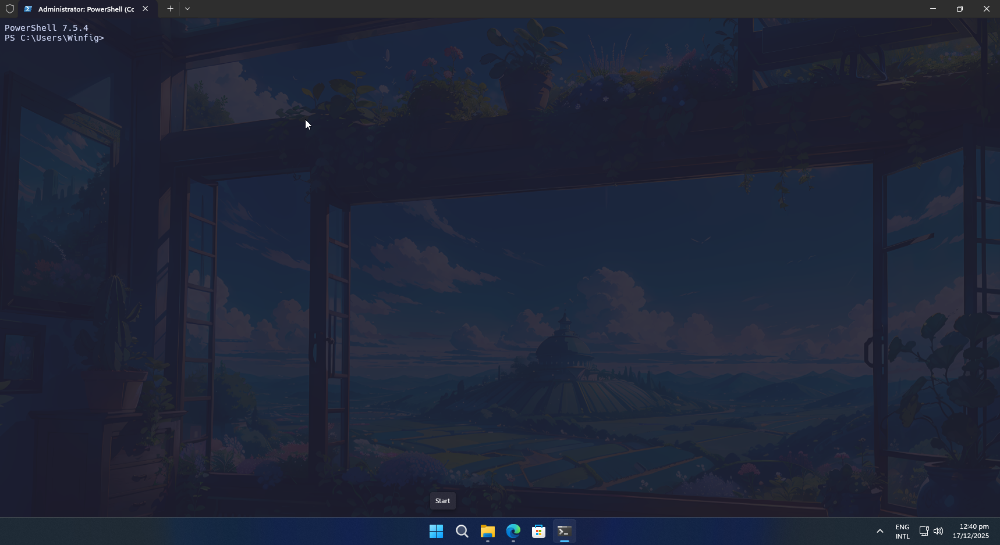

<h1 align="center">Winfig Terminal: Your Complete Windows Configuration and Automation Framework</h1>


<div align="center">
    <strong>Your Complete Windows Configuration and Automation Framework</strong>
</div>

---

## Overview

**Winfig Terminal** is a setup script that automates the customization and configuration of Windows Terminal to enhance your command-line experience. It allows you to easily configure profiles, themes, and settings to suit your workflow.

---

## Features

- [x] **Easy Installation:** Simple script to set up Windows Terminal with your preferred configurations.
- [x] **Custom Profiles:** Pre-configured profiles for PowerShell, Command Prompt, WSL, and more.
- [x] **Theming:** Apply custom themes and color schemes to enhance the visual appeal.
- [x] **Automation:** Automate repetitive tasks and configurations with ease.
- [x] **Extensibility:** Easily extend and modify configurations to fit your needs.
- [x] **Open Source:** Fully open-source and community-driven.

---

## Requirements

- [x] [Windows Terminal](https://aka.ms/terminal) installed
- [x] [PowerShell 7+](https://github.com/PowerShell/PowerShell)
- [x] [Git](https://git-scm.com/download/win) installed
- [x] Administrator privileges for certain configurations
- [x] Internet access for downloading dependencies
- [x] [Nerd Fonts](https://github.com/ryanoasis/nerd-fonts/releases/download/v3.4.0/Hack.zip) for enhanced terminal appearance
- [x] *(Optional)* [Windows Subsystem for Linux (WSL)](https://aka.ms/wsl) for Linux profiles
- [x] *(Optional)* [Distrobox inside WSL](https://github.com/Distrobox/distrobox) for Linux profiles

!!! tip "Quick Install"
    - **Windows Terminal:**
      `winget install --id Microsoft.WindowsTerminal -e`
    - **PowerShell 7:**
      `winget install --id Microsoft.Powershell -e`
    - **Git:**
      `winget install --id Git.Git -e`
    - **Nerd Fonts:**
      Download from [Nerd Fonts](https://github.com/ryanoasis/nerd-fonts/releases/download/v3.4.0/Hack.zip) and install your favorite patched font.
    - **WSL:**
      `wsl --install` (Requires Windows 10 version 2004 and higher or Windows 11)
    - **Distrobox:**
      Follow the installation instructions on the [Distrobox GitHub page](https://github.com/Distrobox/distrobox).

---

## Installation Methods

=== "Web Install (Recommended)"

    **One-line installation** - Downloads and runs automatically:

    ```powershell title="Run in Administrative PowerShell"
    Invoke-RestMethod -useb https://raw.githubusercontent.com/Get-Winfig/winfig-terminal/main/setup.ps1 | Invoke-Expression
    ```

    !!! success "Why Web Install?"
        - Always gets the latest version
        - No manual download required
        - Automatic script verification
    

=== "Local Install"

    **Download and run manually** for offline environments:

    ```powershell title="1. Set Execution Policy"
    Set-ExecutionPolicy RemoteSigned -Scope CurrentUser
    ```

    ```powershell title="2. Download Script"
    # Download from GitHub
    Invoke-WebRequest -useb "https://raw.githubusercontent.com/Get-Winfig/winfig-terminal/main/setup.ps1" -OutFile "setup.ps1"
    ```

    ```powershell title="3. Unblock and Run"
    Unblock-File -Path .\setup.ps1
    .\setup.ps1
    ```

    !!! warning "Note"
        - Ensure you have the latest script version
        - Manual updates required for new releases
        - Verify script integrity before running
    

---

## Workflow

1. **Run the Setup Script:** Execute the installation script using one of the methods above.
2. **Select Configurations:** Choose your desired profiles, themes, and settings during the interactive prompts.
3. **Catppuchin theme:** By Default the Catppuchin Mocha theme will be applied to your Windows Terminal so make sure to select it.
4. **Hack Nerd Fonts:** By Default `Hack Nerd Fonts` are set as the default font for all profiles.
5. **Apply Changes:** The script will automatically apply the configurations to Windows Terminal.
6. **Restart Windows Terminal:** Close and reopen Windows Terminal to see the changes.
7. **Enjoy Your Customized Terminal:** Start using your newly configured Windows Terminal!



---

## Keybindings

Winfig Terminal includes several useful keybindings to enhance your productivity:

| Action                        | Keybinding                         |
|-------------------------------|------------------------------------|
| **Copy**                      | <kbd>Ctrl</kbd> + <kbd>C</kbd>     |
| **Paste**                     | <kbd>Ctrl</kbd> + <kbd>V</kbd>     |
| **Open New Tab**              | <kbd>Alt</kbd> + <kbd>T</kbd>      |
| **Close Tab**                 | <kbd>Alt</kbd> + <kbd>Shift</kbd> + <kbd>Q</kbd> |
| **Duplicate Tab**             | <kbd>Ctrl</kbd> + <kbd>Shift</kbd> + <kbd>D</kbd> |
| **Next Tab**                  | <kbd>Ctrl</kbd> + <kbd>Tab</kbd>   |
| **Previous Tab**              | <kbd>Ctrl</kbd> + <kbd>Shift</kbd> + <kbd>Tab</kbd> |
| **Rename Tab**                | <kbd>Ctrl</kbd> + <kbd>Shift</kbd> + <kbd>R</kbd> |
| **Switch to Tab 1-9**         | <kbd>Alt</kbd> + <kbd>1</kbd> ... <kbd>Alt</kbd> + <kbd>9</kbd> |
| **Split Pane**                | <kbd>Alt</kbd> + <kbd>P</kbd>      |
| **Close Pane**                | <kbd>Alt</kbd> + <kbd>Q</kbd>      |
| **Resize Pane Left**          | <kbd>Shift</kbd> + <kbd>Left</kbd> |
| **Resize Pane Right**         | <kbd>Shift</kbd> + <kbd>Right</kbd>|
| **Resize Pane Up**            | <kbd>Shift</kbd> + <kbd>Up</kbd>   |
| **Resize Pane Down**          | <kbd>Shift</kbd> + <kbd>Down</kbd> |
| **Move Focus Left**           | <kbd>Alt</kbd> + <kbd>Left</kbd>   |
| **Move Focus Right**          | <kbd>Alt</kbd> + <kbd>Right</kbd>  |
| **Move Focus Up**             | <kbd>Alt</kbd> + <kbd>Up</kbd>     |
| **Move Focus Down**           | <kbd>Alt</kbd> + <kbd>Down</kbd>   |
| **Toggle Fullscreen**         | <kbd>F11</kbd>  or <kbd>Alt</kbd> + <kbd>Enter</kbd> |
| **Open Settings**             | <kbd>Ctrl</kbd> + <kbd>,</kbd>     |
| **Command Palette**           | <kbd>Ctrl</kbd> + <kbd>Shift</kbd> + <kbd>P</kbd> |

> 💡 *Tip: You can further customize these keybindings in your Windows Terminal settings file!*

---

## Uninstall & Revert

To uninstall Winfig Terminal and revert to your previous Windows Terminal settings, follow these steps:

1. **Navigate to the Windows Terminal Settings Folder:**
   Open PowerShell and run:
   ```powershell
   cd $env:LOCALAPPDATA\Packages\Microsoft.WindowsTerminal_8wekyb3d8bbwe\LocalState
   ```

2. **Note about Symlinked Settings:**
   If you used Winfig Terminal's dotfiles integration, your `settings.json` here is a **symlink** to
   `%USERPROFILE%\.Dotfiles\winfig-terminal\settings.json`.

   - To break the link and restore default behavior, first remove the symlink:
     ```powershell
     Remove-Item -Path settings.json
     ```
   - Then, either let Windows Terminal regenerate a default `settings.json` or copy your backup or a default config into this folder.

3. **Backup Current Settings (if not a symlink):**
   It's a good idea to back up your current settings before making changes:
   ```powershell
   Copy-Item -Path settings.json -Destination settings.json.bak
   ```

4. **Restore Previous Settings:**
   If you have a backup of your previous settings, you can restore it by copying it back:
   ```powershell
   Copy-Item -Path "path\to\your\backup\settings.json" -Destination settings.json
   ```

5. **Restart Windows Terminal:**
   Close and reopen Windows Terminal to apply the changes.

---

> **Tip:**
> If you want to fully remove Winfig Terminal's configuration, also delete or archive the `%USERPROFILE%\.Dotfiles\winfig-terminal\settings.json` file.

---

## Frequently Asked Questions (FAQ)

??? question "Is Winfig Terminal safe to use?"
    **Yes.** Winfig Terminal is open-source and the script is available for review on GitHub. Always ensure you download the script from the official repository.

??? question "Can I customize the configurations after installation?"
    **Absolutely!** You can modify the `settings.json` file in Windows Terminal to further customize your setup.

??? question "How do I update Winfig Terminal?"
    **To update,** simply rerun the installation script using the web install method to get the latest configurations.

??? question "What if I encounter issues during installation?"
    **If you face any issues,** please check the GitHub repository for troubleshooting tips or open an issue for assistance.

---

## Troubleshooting Guide

If you encounter any issues while using Winfig Terminal, here are some common problems and their solutions:

| Issue                                    | Solution                                                                                     |
|------------------------------------------|----------------------------------------------------------------------------------------------|
| Winfig Terminal is not launching         | Ensure that you have the latest version of Windows Terminal installed.                      |
| Configuration changes are not applied   | Double-check the `settings.json` file for any syntax errors.                               |
| Performance issues                       | Try disabling any unnecessary features or extensions in Windows Terminal.                   |
| Script fails to run                      | Make sure you have the required permissions and that PowerShell execution policy allows script running. |
| Profiles not showing up                  | Verify that the profiles are correctly defined in the `settings.json` file.                 |
| Color schemes not applied                | Ensure that the color scheme definitions are correctly formatted in the settings file.     |
| Keybindings not working                  | Check for conflicts with other applications or custom keybindings in Windows Terminal.     |
| Font rendering issues                    | Make sure you have installed a Nerd Font and set it as the default font in your profiles.  |
| Issues with WSL profiles                 | Ensure that WSL is properly installed and configured on your system.                        |
| Unable to update Winfig Terminal         | Check your internet connection and ensure you are using the web install method.            |
